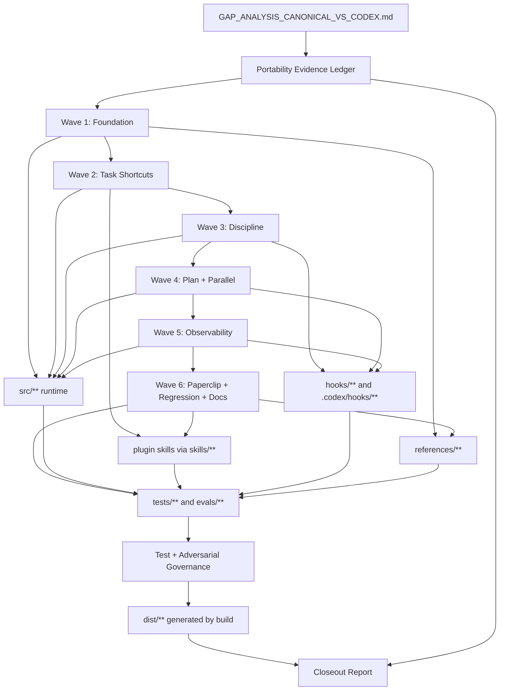

# Design

**Version:** 0.1.1
**Date:** 2026-06-12
**Status:** ready_for_wave_gate

## 1. Overview

This design turns the audit in `docs/GAP_ANALYSIS_CANONICAL_VS_CODEX.md` into a six-wave portability program. The design preserves the Codex repository as the operational SSOT, adapts canonical behavior feature-by-feature, and prevents doc-only parity claims.

The implementation principle is: **verify current Codex state, port behavior into the right runtime surface, add proportional tests, run Eval Gate, then claim only what evidence proves.**

## 2. Architecture Overview

The architecture is a repo-first portability program. `requirements.md` defines the canonical target and evidence rules, this design owns the component and contract map, `tasks.md` owns wave execution, and runtime/test artifacts remain the source of truth for any implementation or parity claim.

Dependency direction is:

`Audit Inputs -> Spec Artifacts -> Ledger -> Runtime/Skills/Hooks/References -> Tests/Eval Gate -> Closeout Evidence`

No downstream document may claim behavior unless the runtime, package surface, installed cache, or live smoke layer named in the closeout evidence proves that behavior.

## 3. Architecture



## 4. Decisions

### ADR-001: Runtime Evidence Is the Portability Authority

**Status:** Accepted
**Requirements:** REQ-001, REQ-008

Decision: portability claims are bounded by the strongest evidence layer available: repo-only, package-surface, installed-cache, or live-smoke.

Rationale: this prevents a local repository change from being mistaken for a published or active plugin behavior.

### ADR-002: Public Codex Behavior Ships Through Skills

**Status:** Accepted
**Requirements:** REQ-003

Decision: new public plugin behavior is delivered through `skills/<name>/SKILL.md` and manifest/cache proof, while `commands/**` remains compatibility or documentation only.

Rationale: this matches the Codex plugin surface used by this repository and avoids promising unsupported command behavior.

### ADR-003: Missing Real Agent Runtime Blocks Operational Claims

**Status:** Accepted
**Requirements:** REQ-005, REQ-009

Decision: when required `spawn_agent`/`wait_agent` support or artifact collection is unavailable, the operational path stops with `blocked-no-agent-runtime` and reports `pipeline_valid: false`.

Rationale: manual or harness fallback can diagnose but cannot count as a valid multi-agent pipeline execution.

## 5. Alternatives Considered

- Copy canonical Claude Code modules directly. Rejected because it would create a parallel CommonJS/Claude-oriented runtime instead of a Codex TypeScript adaptation.
- Treat generated docs as sufficient parity evidence. Rejected because the repository contract requires runtime/test evidence before public claims.
- Add public shortcuts as new `commands/**` files. Rejected because Codex plugin public behavior must be proven through skills, manifest/cache boundaries, and smoke evidence.
- Allow manual adversarial review to satisfy wave governance. Rejected because the wave gate requires real isolated Codex subagent evidence for operational pipeline claims.

## 6. Boundary Commitments

### Owned by this spec

- The v7.12 portability implementation plan.
- Runtime, skill, hook, reference, test, and documentation changes needed to close the audit gaps.
- Evidence tracking for each gap and each wave.
- Eval Gate validation for governed changes.

### Not owned by this spec

- Canonical v8 work or new audits after 2026-06-11.
- Direct Marketplace/cache publication unless a later implementation task explicitly enters closeout/publication mode.
- Replacing the TypeScript runtime with Claude-style CommonJS or markdown-only orchestration.
- Removing Codex-exclusive features.

### Revalidation triggers

Re-run design/task review if any of these happen:

- Canonical target changes from v7.12.0.
- Codex host changes available agent, hook, Plan Mode, or plugin primitives.
- `skills/pipeline/SKILL.md` changes its operational contract.
- Eval Gate rules change.
- A wave discovers that an audit gap is already solved or materially different from the report.

## 7. Components and Interfaces

### 4.1 Portability Evidence Ledger

**Purpose:** Track each audit item as `open`, `partial`, `closed`, `not-applicable`, or `deferred`, with evidence links.

**Likely files:**

- `docs/PORTABILITY_CLOSEOUT_V7_12.md` (new)
- `docs/GAP_ANALYSIS_CANONICAL_VS_CODEX.md` (input only)
- `evals/outputs/latest_output.md` (updated by Eval Gate workflow)

**Requirements:** REQ-001, REQ-008
**Owner/Reviewers:** plan-architect / quality-reviewer
**Selected contracts:** State, Batch

**Design notes:**

- The ledger should not become a second source of behavior. It records evidence and status only.
- Each row should include source audit section, Codex evidence path, wave, status, and verification command/result.

### 4.2 Foundation Runtime Layer

**Purpose:** Port gates, hardness taxonomy, gate-decision SSOT, and skill-dispatch wiring.

**Likely files:**

- `src/gates/gate-registry.ts`
- `src/gates/hardness-policy.ts`
- `src/state/gate-log.ts`
- `src/domain/pipeline-schemas.ts`
- `src/controller/pipeline-controller.ts`
- `src/controller/workflow-selection.ts`
- `src/controller/parse-mode.ts`
- `references/gates/**`
- `references/complexity-matrix.md`
- `tests/unit/gates/**`
- `tests/integration/controller-parity.test.ts`

**Requirements:** REQ-002
**Owner/Reviewers:** executor-controller / architecture-critic
**Selected contracts:** Service, State

**Design notes:**

- `AUDIT` hardness is informational only and must not block.
- Gate-decision vocabulary must be validated centrally.
- Skill-dispatch routing should preserve existing direct task-type classification for backward compatibility while enabling explicit skill entrypoints.

### 4.3 Public Skill Surface

**Purpose:** Add user-facing shortcuts and the missing brainstorm alternative agent.

**Likely files:**

- `skills/user-story/SKILL.md`
- `skills/user-story-light/SKILL.md`
- `skills/user-story-heavy/SKILL.md`
- `skills/ux-sim/SKILL.md`
- `skills/ux-sim-light/SKILL.md`
- `skills/ux-sim-heavy/SKILL.md`
- `agents/brainstorm/step-01b-alternatives.md`
- `references/pipelines/user-story-light.md`
- `references/pipelines/user-story-heavy.md`
- `references/pipelines/ux-sim-light.md`
- `references/pipelines/ux-sim-heavy.md`
- `tests/integration/**`

**Requirements:** REQ-003
**Owner/Reviewers:** executor-controller / quality-reviewer
**Selected contracts:** Service

**Design notes:**

- `ux-sim` remains report-only. Its tasks should validate no write path is opened unless another explicit workflow starts implementation.
- New public Codex behavior must ship as plugin skills through `plugin.json:skills`; `commands/**` files are compatibility/documentation shims only and must not be treated as Codex plugin slash-command surfaces.
- Markdown files under `agents/**` are internal role prompts. If a feature needs real Codex custom subagents, the design must add `.codex/agents/*.toml`, load/selection tests, and host `spawn_agent` smoke proof.

### 4.4 Implementation Discipline Layer

**Purpose:** Add integrity and scope-discipline controls.

**Likely files:**

- `src/sentinel/sentinel-state.ts`
- `src/review/**`
- `agents/quality/diff-discipline-reviewer.md`
- `hooks/edit-guard-hook.cjs`
- `hooks/sentinel-hook.cjs`
- `hooks/dispatch-guard.cjs`
- `references/implementation-discipline.md`
- `references/visible-plan-contract.md`
- `tests/unit/sentinel/**`
- `tests/integration/**scope**.test.ts`

**Requirements:** REQ-004
**Owner/Reviewers:** executor-controller / security-scanner
**Selected contracts:** Service, State

**Design notes:**

- HMAC signing requires secret handling. The design must avoid committing secrets and must define behavior when the signing key is unavailable.
- Scope Lock should be enforced in hooks/runtime, not just described in docs.
- Every hook-backed enforcement claim must prove the hook is registered from the intended layer, uses `type: "command"` when enforcement is required, is trusted/active where applicable, and passes a deny/log smoke check.

### 4.5 Execution Maturity Layer

**Purpose:** Port race-safe run directories, Plan Mode roster/enforcement, and real safe parallelism.

**Likely files:**

- `src/run/run-directory.ts`
- `src/controller/plan-mode.ts`
- `src/dispatcher/**`
- `src/execution/**`
- `hooks/dispatch-guard.cjs`
- `references/plan-mode-mandatory-agents.json` (new or updated)
- `references/openai-codex-kb/agents-and-subagents.md`
- `tests/unit/run/**`
- `tests/integration/parallel-dispatch*.test.ts`

**Requirements:** REQ-005
**Owner/Reviewers:** executor-controller / architecture-critic
**Selected contracts:** Service, Batch

**Design notes:**

- Real parallel dispatch depends on Codex host capability. If mandatory runtime capability is unavailable, the operational path must stop with `blocked-no-agent-runtime`; only explicit diagnostic harness or manual fallback may continue, and it must report `pipeline_valid: false`.
- File-scope disjointness must happen before dispatch.
- The Plan Mode roster is an internal plugin roster unless this design explicitly creates `.codex/agents/*.toml` custom subagents and validates Codex host selection.

### 4.6 Observability Layer

**Purpose:** Add canonical-grade run evidence, fidelity, scores, correlation, and opt-in Langfuse tracing.

**Likely files:**

- `src/observability/**`
- `src/run/run-log.ts` (new)
- `src/reports/fidelity-reporter.ts` (new)
- `src/state/score-writer.ts` (new)
- `src/state/gate-log.ts`
- `hooks/**`
- `.codex/hooks/**`
- `package.json` (only if Langfuse dependency is approved)
- `tests/unit/observability/**`
- `tests/integration/langfuse*.test.ts`

**Requirements:** REQ-006
**Owner/Reviewers:** executor-controller / security-scanner
**Selected contracts:** Event, State

**Design notes:**

- Langfuse must be opt-in and inert without environment variables.
- Sanitization is part of the integration, not a later nice-to-have.
- The discovery pointer should name the authoritative run document path without leaking private local-only data outside the allowed scope.

### 4.7 Paperclip and Regression Layer

**Purpose:** Complete Paperclip advanced support and protect canonical parity with tests/docs.

**Likely files:**

- `references/paperclip/spec/lib/**`
- `references/paperclip/scripts/provision-pipeline-company.cjs`
- `references/paperclip/**`
- `skills/measure-paperclip-fidelity/SKILL.md`
- `hooks/completion-checklist.cjs`
- `hooks/session-cleanup-hook.cjs`
- `tests/compat/**`
- `tests/regression/**`
- `tests/bdd/**`
- `docs/migrations/**`
- `docs/diagrams/**`
- `docs/examples/**`
- `.kiro/specs/paperclip-task-tree-factory/**`

**Requirements:** REQ-007
**Owner/Reviewers:** plan-architect / quality-reviewer
**Selected contracts:** Service, Batch

**Design notes:**

- Regression tests should be added with the feature they protect, not only at the end.
- Paperclip install/provision evidence must distinguish repo state from deployed Paperclip state.

### 4.8 Closeout and Publication Boundary

**Purpose:** Prevent false "ready/published/active" claims.

**Likely files:**

- `CHANGELOG.md`
- `PROJECT_CONTEXT.md` if present and used as operational context
- `README.md` only after runtime supports the claim
- `.codex-plugin/plugin.json`
- `package.json`
- `.agents/plugins/marketplace.json` or `C:\Users\win\.agents\plugins\marketplace.json` when marketplace proof is in scope
- installed Codex cache path when cache proof is in scope
- `hooks/hooks.json` user-facing text
- `evals/outputs/latest_output.md`
- generated `dist/**` after `npm run build`

**Requirements:** REQ-008
**Owner/Reviewers:** final-validator / quality-reviewer
**Selected contracts:** State, Batch

**Design notes:**

- Closeout reports must separate local repo implementation, generated package surface, Marketplace/local copy, installed Codex cache, and live smoke result.
- If publication/cache sync is not executed, the closeout must say so plainly.
- Package metadata and front-door descriptions must be updated or explicitly deferred after runtime and cache smoke proof; v0.5/v5.2 messaging must not remain silently stale when the claim becomes v7.12 parity.

### 4.9 Test and Adversarial Review Governance

**Purpose:** Make TDD, BDD, DDD, Codex harness validation, and adversarial review loops mandatory execution mechanics instead of aspirational checkboxes.

**Likely files:**

- `.kiro/specs/canonical-v7-portability-closeout/tasks.md`
- `tests/unit/**`
- `tests/integration/**`
- `tests/bdd/**`
- `tests/compat/**`
- `tests/regression/**`
- `evals/outputs/latest_output.md`
- `evals/telemetry/**`

**Requirements:** REQ-009
**Owner/Reviewers:** plan-architect / final-adversarial-orchestrator
**Selected contracts:** Batch, State

**Design notes:**

- Each wave must start with a test plan that names red TDD tests, BDD scenarios, DDD/domain invariants, and Codex harness checks before implementation.
- After each TDD, BDD, and DDD test group, a fresh independent adversarial review must run before the wave can proceed.
- Any adversarial review, alternative agent, or final specialized reviewer counts only when it runs as a real Codex subagent through `spawn_agent`/`wait_agent` with artifact collection. If that runtime capability is unavailable, the operational wave stops with `blocked-no-agent-runtime`, `pipeline_valid: false`, and any manual/harness fallback is explicitly non-pipeline evidence.
- Review/fix loops are capped at three attempts for the same problem area.
- After the third failed loop, the orchestrator must spawn a fresh independent alternative agent without forked project context to propose a different path.
- The final review must include specialized agents for Codex harness architecture, engineering quality, and plugin execution adaptability and must return zero findings before completion is claimed.
- Complete portability for public plugin, skill, hook, or workflow behavior requires package-surface proof plus installed-cache smoke proof. `repo-only` evidence may close a local wave only when the closeout labels the claim as repo-only.
- A Codex-native equivalent must prove the same public trigger, observable behavior, gate/blocking semantics, telemetry/evidence, dedicated tests, ledger entry, and adversarial approval.

## 8. Contracts/Interfaces

### Service Contracts

- `skill_dispatch_router`: routes public workflow shortcuts by skill identity where required by REQ-003.
- `gate_decision_writer`: writes canonical `gate-decisions.jsonl` entries for REQ-002.
- `scope_lock_check`: accepts a change contract and denies writes outside the approved scope for REQ-004.
- `fidelity_reporter`: reports fidelity using the gate vocabulary for REQ-006.

### Batch Contracts

- `wave_closeout`: records changed files, generated files, tests, Eval Gate result, parity claim level, and remaining risks for REQ-008.
- `wave_gate`: records TDD, BDD, DDD, harness checks, adversarial review evidence, and loop-cap state for REQ-009.

### State Contracts

- `portability_gap_status`: records audit section, wave, status, evidence, and verification result for REQ-001.
- `sentinel_state_integrity`: records sentinel state signature or equivalent tamper evidence for REQ-004.
- `telemetry_correlation`: links runtime, hook, and report artifacts for REQ-006.

## 9. Data Models

### Gap status row

```typescript
type GapStatus = "open" | "partial" | "closed" | "not-applicable" | "deferred";

interface PortabilityGapStatus {
  auditSection: string;
  title: string;
  wave: 1 | 2 | 3 | 4 | 5 | 6;
  status: GapStatus;
  codexEvidence: string[];
  canonicalEvidence?: string[];
  verification: {
    commandOrCheck: string;
    result: "pass" | "fail" | "blocked" | "not-run";
    notes: string;
  };
}
```

### Wave closeout

```typescript
interface WaveCloseout {
  wave: number;
  changedFiles: string[];
  generatedFiles: string[];
  testsRun: string[];
  evalGateResult: "pass" | "fail" | "not-required" | "blocked";
  parityClaim: "none" | "repo-only" | "package-surface" | "installed-cache" | "live-smoke";
  remainingRisks: string[];
}
```

## 10. API Contracts

This spec does not introduce external HTTP APIs. API contract status is N/A for product endpoints because the work targets plugin runtime, skills, hooks, reports, and local evidence artifacts.

Internal contract boundaries:

- Inputs: audit findings, steering files, spec artifacts, runtime state, hook state, package metadata, installed cache evidence, and smoke results.
- Outputs: ledger rows, gate decisions, wave closeout reports, Eval Gate output, regression fixtures, and final parity claim level.
- Errors: missing required artifact, invalid format gate, unavailable agent runtime, failed Eval Gate, stale package/cache proof, and adversarial review finding.

## 11. Correctness Properties

- A parity claim must never exceed the strongest available evidence layer.
- A mandatory gate must not be bypassable by hotfix or force behavior unless a requirement explicitly allows it.
- A wave cannot close unless its relevant test, review, and evidence contracts are recorded.
- Manual fallback review must not be counted as real multi-agent pipeline evidence.
- Public plugin/skill/hook portability cannot be marked complete without package-surface proof and installed-cache smoke proof.

## 12. DI/CI Invariants

- Runtime components depend on typed gate, state, dispatcher, and observability contracts rather than documentation-only claims.
- Hook-backed enforcement must be validated from the registered hook layer before being reported as active enforcement.
- Generated `dist/**` is build output only and must not be edited manually.
- Eval Gate remains an independent validation step for governed runtime, workflow, plugin, skill, hook, command, telemetry, gate, trace, batch, or review changes.

## 13. Operational

- Observability: wave closeout and telemetry correlation must identify the authoritative run artifacts used for each claim.
- Alerts: a failed gate, failed Eval Gate, missing real agent runtime, or adversarial finding routes to blocked or corrective follow-up work.
- Rollback strategy: revert or supersede only the affected wave changes; do not roll back unrelated repository state.
- Publication boundary: if Marketplace/cache sync is not performed, closeout must explicitly limit the claim to repo-only or package-surface evidence.

## 14. Requirements Traceability

| Requirement | Summary | Components | Interfaces | Flows |
| --- | --- | --- | --- | --- |
| REQ-001 | Freeze and verify portability baseline | Portability Evidence Ledger | `portability_gap_status` | Audit -> Ledger -> Wave |
| REQ-002 | Restore foundation parity | Foundation Runtime Layer | `gate_decision_writer`, gate hardness state | Gate verification -> Runtime tests |
| REQ-003 | Add public task shortcuts | Public Skill Surface | `skill_dispatch_router` | Skill trigger -> Dispatch evidence |
| REQ-004 | Enforce implementation discipline | Implementation Discipline Layer | `scope_lock_check`, `sentinel_state_integrity` | Change contract -> Hook/runtime denial |
| REQ-005 | Mature Plan Mode and parallel execution | Execution Maturity Layer | wave dispatch batch contracts | Plan Mode roster -> Dispatch guard |
| REQ-006 | Add observability and telemetry | Observability Layer | `fidelity_reporter`, `telemetry_correlation` | Runtime/hook/report correlation |
| REQ-007 | Complete Paperclip and regression portability | Paperclip and Regression Layer | Paperclip service/batch contracts | Flow mirror -> Regression evidence |
| REQ-008 | Close out with honest parity evidence | Closeout and Publication Boundary | `wave_closeout` | Validation -> Claim boundary |
| REQ-009 | Enforce test and adversarial governance | Test and Adversarial Review Governance | `wave_gate` | Test group -> Review -> Loop cap |

## 15. Testing Strategy

- Run focused tests for each changed runtime area.
- For every wave, define TDD tests before implementation and keep red/green/refactor evidence.
- For behavior-level workflow changes, add or update BDD scenarios and verify they do not replace deterministic tests.
- For domain/routing/governance changes, define DDD/domain invariants such as SSOT ownership, gate vocabulary, public surface boundaries, and runtime capability boundaries.
- Run an independent adversarial review after each TDD, BDD, and DDD test group before moving on.
- If a review finds a defect, route back to implementation and repeat up to three loops; on the third repeated failure, spawn a fresh no-context alternative agent.
- Run `npm run lint:types`, `npm run build`, `npm test`, and `python .agents/skills/workflow-eval-gate/scripts/run_eval.py` for every wave closeout.
- Focused Vitest subsets may substitute for `npm test` only after a real `npm test` attempt is documented as blocked by Windows memory/IPC behavior.
- Run `python .agents/skills/workflow-eval-gate/scripts/run_eval.py` after every governed workflow/plugin/skill/hook/command/script change and record the result in the wave closeout.
- Validate plugin/skill surfaces with a matrix covering manifest schema/path existence, skill folder/frontmatter name alignment, skill descriptions, governed-skill repo tests, hook deny paths, hook `type: "command"` enforcement, public skill dispatch, installed-cache boundary, and Eval Gate.
- For hooks and telemetry, record whether local hooks were actually trusted/active; otherwise report manual telemetry.
- Add canonical-version regression coverage in the same wave as each canonical behavior port; Wave 6B may consolidate fixtures/docs, but it must not postpone regression protection for behavior shipped in earlier waves.

## 7. Migration Strategy

1. Start with Wave 1 to stabilize the foundation.
2. Ship one wave at a time.
3. Do not mark future waves as done because prior waves pass.
4. Update docs only after runtime/tests support the behavior.
5. At final closeout, decide whether Marketplace/cache sync is in scope for that run.

## 8. Risks and Mitigations

| Risk | Mitigation |
| --- | --- |
| Mechanical CJS copy into TS creates duplicated runtime | Port behavior into existing TS modules with type-safe tests |
| Doc-runtime drift | Change runtime/tests first, docs second |
| Parallel execution claims exceed Codex host capability | Capability check before dispatch; mandatory runtime gaps stop with `blocked-no-agent-runtime` |
| Telemetry leaks private content | Sanitizer and opt-in tracing only |
| Scope too large for one PR | Six waves with independent closeout |
| Existing partial implementation is overwritten | Verify-before-port task at the start of each wave |
