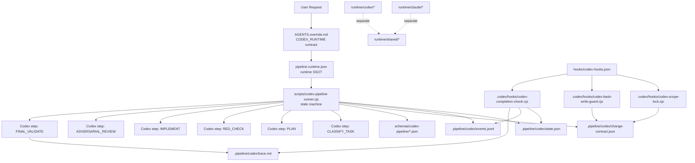

# Technical Design: Codex Runtime Hardening

## 1. Overview

Esta spec implementa a separacao operacional entre Claude_Runtime e Codex_Runtime. O design reduz a dependencia de prompt longo e cria uma cadeia verificavel:

```text
AGENTS.override.md
  -> pipeline.runtime.json
  -> scripts/codex-pipeline-runner.cjs
  -> .pipeline/codex/state.json
  -> .pipeline/codex/change-contract.json
  -> hooks Codex-native
  -> schemas de etapa
  -> trace e completion check
```

A mudanca central e trocar "peca ao Codex para obedecer um workflow" por "um runner controla o workflow e chama Codex para passos pequenos, estruturados e validaveis".

## 2. Architecture Diagram



## 3. Components and File Mapping

### 3.1 Codex Runtime Contract

| Attribute | Value |
| --- | --- |
| Files | `AGENTS.override.md`, `runtime/codex/AGENTS.override.md` |
| Requirements | R1, R9 |
| Priority | P0 |

Responsibilities:

1. Declare `CODEX_RUNTIME`.
2. Quarantine Claude-only tool names.
3. Point to `pipeline.runtime.json`, runner, state files and CHANGE_CONTRACT.
4. Keep instructions short and operational.

Design note: Official AGENTS.md docs say Codex reads `AGENTS.override.md` before `AGENTS.md` at each scope and includes at most one instruction file per directory. This is why the override is the appropriate Codex-specific surface.

### 3.2 Runtime Manifest

| Attribute | Value |
| --- | --- |
| File | `pipeline.runtime.json` |
| Requirements | R2, R9 |
| Priority | P1 |

Proposed shape:

```json
{
  "version": "repo-package-version",
  "runtime_contract_version": "codex-1",
  "canonical_entrypoints": {
    "codex": "scripts/codex-pipeline-runner.cjs",
    "claude": "runtime/claude/pipeline-command.md",
    "public_command": "commands/pipeline.md"
  },
  "codex": {
    "instructions": "AGENTS.override.md",
    "hooks": "hooks/codex-hooks.json",
    "state_dir": ".pipeline/codex",
    "change_contract": ".pipeline/codex/change-contract.json"
  },
  "agent_count": {
    "production": null,
    "including_type_specific": null,
    "paperclip_roster": null
  }
}
```

### 3.3 Codex Hook Layer

| Attribute | Value |
| --- | --- |
| Files | `hooks/codex-hooks.json`, `.codex/hooks/codex-scope-lock.cjs`, `.codex/hooks/codex-bash-write-guard.cjs`, `.codex/hooks/codex-completion-check.cjs` |
| Requirements | R3, R4, R7, R10 |
| Priority | P0 |

Official Codex hook docs checked for this design:

- `PreToolUse` can intercept `Bash`, edits through `apply_patch`, and MCP tool calls.
- For file edits, matcher aliases can include `apply_patch`, `Edit`, or `Write`, but hook input still reports canonical `tool_name: "apply_patch"`.
- Bash and `apply_patch` hook input use `tool_input.command`.
- Denial uses `hookSpecificOutput.permissionDecision: "deny"` or the older block shape.

Hook output contract:

```json
{
  "hookSpecificOutput": {
    "hookEventName": "PreToolUse",
    "permissionDecision": "deny",
    "permissionDecisionReason": "SCOPE_LOCK: target outside CHANGE_CONTRACT"
  }
}
```

### 3.4 Patch Target Parser

| Attribute | Value |
| --- | --- |
| File | `runtime/codex/patch-parser.cjs` or `.codex/hooks/lib/patch-parser.cjs` |
| Requirements | R3, R4 |
| Priority | P0 |

Patch parser extracts every file target from:

```text
*** Add File: path
*** Update File: path
*** Delete File: path
*** Move to: path
```

Invariant: every target must be checked. If parser returns zero targets for an edit-like patch, fail closed.

### 3.5 CHANGE_CONTRACT Schema

| Attribute | Value |
| --- | --- |
| File | `schemas/codex-pipeline/change-contract.schema.json` or TypeScript/Zod equivalent |
| Requirements | R4, R6 |
| Priority | P0 |

Proposed fields:

```json
{
  "schema_version": "codex-change-contract-v1",
  "run_id": "string",
  "task_type": "Bug Fix|Feature|Hotfix|Auditoria|Security|Spec",
  "allowed_files": ["string"],
  "forbidden_files": ["string"],
  "required_checks": ["string"],
  "acceptance_checks": ["string"],
  "risk_level": "Critica|Alta|Media|Baixa",
  "created_at": "ISO-8601",
  "approved": true
}
```

### 3.6 Deterministic Runner

| Attribute | Value |
| --- | --- |
| File | `scripts/codex-pipeline-runner.cjs` |
| Requirements | R5, R6, R7, R8 |
| Priority | P0 |

State transitions:

```js
const allowedTransitions = {
  INIT: ["CLASSIFY_TASK"],
  CLASSIFY_TASK: ["LOAD_CHANGE_CONTRACT"],
  LOAD_CHANGE_CONTRACT: ["PLAN"],
  PLAN: ["APPROVE_OR_BLOCK"],
  APPROVE_OR_BLOCK: ["RED_CHECK"],
  RED_CHECK: ["IMPLEMENT"],
  IMPLEMENT: ["TARGETED_CHECKS"],
  TARGETED_CHECKS: ["ADVERSARIAL_REVIEW"],
  ADVERSARIAL_REVIEW: ["FINAL_VALIDATE"],
  FINAL_VALIDATE: ["TRACE"],
  TRACE: ["DONE"]
};
```

The runner is the only component allowed to advance state. Codex step output may request a next step, but the runner decides whether the transition is valid.

### 3.7 Step Schemas

| Attribute | Value |
| --- | --- |
| Files | `schemas/codex-pipeline/*.schema.json` or `src/codex-runtime/schemas.ts` |
| Requirements | R5, R6 |
| Priority | P1 |

Minimum schemas:

- `classify-task-output.schema.json`
- `plan-output.schema.json`
- `implement-output.schema.json`
- `review-output.schema.json`
- `final-validate-output.schema.json`

Each output includes:

```json
{
  "schema_version": "string",
  "step": "string",
  "status": "PASS|BLOCKED|FAILED",
  "required_next_step": "string",
  "evidence": ["string"]
}
```

### 3.8 Subagent Capability Adapter

| Attribute | Value |
| --- | --- |
| Files | `runtime/codex/subagent-capability.cjs`, existing dispatcher integration if needed |
| Requirements | R8 |
| Priority | P1 |

Official Codex docs checked for this design state that Codex does not spawn subagents automatically and should use subagents only when explicitly requested. Therefore, this plugin must not describe automatic subagent dispatch unless the runner explicitly invokes and logs it.

Modes:

- `real-subagent`: real Codex subagent spawned and lifecycle logged.
- `inline-review`: explicit fallback when allowed by contract.
- `blocked-no-agent-runtime`: required real subagents unavailable.

### 3.9 Runtime Separation Layout

| Attribute | Value |
| --- | --- |
| Files | `runtime/claude/**`, `runtime/codex/**`, `runtime/shared/**` |
| Requirements | R1, R9 |
| Priority | P2 |

Target layout:

```text
runtime/
  claude/
    pipeline-command.md
    adapter-notes.md
  codex/
    AGENTS.override.md
    hooks.json
    runner.cjs
    scope-lock.cjs
    patch-parser.cjs
    bash-write-guard.cjs
    completion-check.cjs
  shared/
    glossary.md
    pipeline-state-machine.md
```

Root files:

```text
AGENTS.md              -> project context and authority order
AGENTS.override.md     -> active Codex runtime contract
CLAUDE.md              -> Claude compatibility context
commands/pipeline.md   -> short public entrypoint
pipeline.runtime.json  -> runtime SSOT
```

### 3.10 Tests and Eval Gate

| Attribute | Value |
| --- | --- |
| Files | `tests/**`, `evals/**`, `.agents/skills/workflow-eval-gate/**` |
| Requirements | R10 |
| Priority | P2 |

Test categories:

1. Static prompt-facing drift checks.
2. Hook config schema checks.
3. Patch parser unit tests.
4. Scope lock integration tests.
5. Runner transition tests.
6. Step schema parse tests.
7. Completion checker tests.
8. Eval Gate run after governed runtime changes.

## 4. Data Model

### State File

```json
{
  "schema_version": "codex-run-state-v1",
  "run_id": "string",
  "current_step": "INIT",
  "status": "ACTIVE|BLOCKED|FAILED|VALIDATED",
  "runtime": "codex",
  "change_contract_path": ".pipeline/codex/change-contract.json",
  "last_event_id": "string",
  "created_at": "ISO-8601",
  "updated_at": "ISO-8601"
}
```

### Event File

```json
{
  "schema_version": "codex-event-v1",
  "event_id": "string",
  "run_id": "string",
  "event": "STEP_COMPLETE|HOOK_DENY|HOOK_ALLOW|CHECK_RUN|REVIEW_COMPLETE",
  "step": "string",
  "status": "PASS|BLOCKED|FAILED",
  "timestamp": "ISO-8601",
  "evidence": ["string"]
}
```

## 5. Failure Modes

| Failure | Detection | Behavior |
| --- | --- | --- |
| No CHANGE_CONTRACT in Codex runtime | Scope lock precheck | Deny edit |
| apply_patch target cannot be parsed | Patch parser returns empty | Deny edit |
| Step output invalid JSON | Runner schema validation | Block run |
| Invalid state transition | Transition table | Block run |
| Required subagent unavailable | Capability probe | `blocked-no-agent-runtime` |
| Hook internal exception | Top-level catch | Deny with sanitized reason |
| Checks skipped | Completion checker | Block unless trace records approved reason |

## 6. Testing Strategy

| Test | File | Covers |
| --- | --- | --- |
| Runtime manifest consistency | `tests/unit/runtime-manifest.test.ts` | R2 |
| Codex hook config compatibility | `tests/unit/codex-hooks-config.test.ts` | R3 |
| apply_patch target parser | `tests/unit/codex-patch-parser.test.ts` | R3, R4 |
| scope lock fail-closed | `tests/integration/codex-scope-lock.test.ts` | R4 |
| runner transitions | `tests/unit/codex-runner-state.test.ts` | R5 |
| step schema validation | `tests/unit/codex-step-schemas.test.ts` | R6 |
| completion check | `tests/integration/codex-completion-check.test.ts` | R7 |
| subagent capability modes | `tests/unit/subagent-capability.test.ts` | R8 |
| runtime separation scan | `tests/unit/runtime-separation.test.ts` | R9 |
| Eval Gate | `python .agents/skills/workflow-eval-gate/scripts/run_eval.py` | R10 |

## 7. Implementation Phases

### Phase 1 - P0 Enforcement Floor

Files:

- `AGENTS.override.md`
- `hooks/codex-hooks.json`
- `.codex/hooks/codex-scope-lock.cjs`
- `.codex/hooks/codex-bash-write-guard.cjs`
- `.codex/hooks/codex-completion-check.cjs`
- `runtime/codex/patch-parser.cjs`

Goal: Codex cannot silently edit production files outside an approved CHANGE_CONTRACT.

### Phase 2 - Runner and Schemas

Files:

- `scripts/codex-pipeline-runner.cjs`
- `schemas/codex-pipeline/**`
- `.pipeline/codex/**` generated state files

Goal: workflow order is controlled by runner, not by prompt obedience.

### Phase 3 - Drift and Runtime Separation

Files:

- `pipeline.runtime.json`
- `runtime/claude/**`
- `runtime/codex/**`
- `runtime/shared/**`
- prompt-facing docs/tests

Goal: Codex and Claude stop sharing incompatible runtime assumptions.

### Phase 4 - Eval and Release Readiness

Files:

- `tests/**`
- `evals/outputs/latest_output.md`
- `CHANGELOG.md` only if implementation changes product behavior

Goal: final proof through existing checks and local Eval Gate.

## 8. Requirement Traceability

| Requirement | Component |
| --- | --- |
| R1 | Codex Runtime Contract |
| R2 | Runtime Manifest |
| R3 | Codex Hook Layer, Patch Parser |
| R4 | CHANGE_CONTRACT, Scope Lock |
| R5 | Deterministic Runner |
| R6 | Step Schemas |
| R7 | Completion Check |
| R8 | Subagent Capability Adapter |
| R9 | Runtime Separation Layout |
| R10 | Tests and Eval Gate |

## 9. Security Considerations

- Deny reasons must avoid raw patch content, environment variables and secrets.
- Shell write parsing is a guardrail, not a complete shell sandbox; the runner should still prefer explicit file edits through `apply_patch`.
- Hook trust must be proven through Codex `/hooks`; file presence alone is not runtime activation.
- Official Codex docs are current-behavior sources and must be rechecked before changing public claims.

## 10. Rollback Plan

| Phase | Rollback |
| --- | --- |
| P0 | Remove `AGENTS.override.md` and Codex hook config, restore prior hook registration |
| P1 | Disable runner behind manifest flag, keep schemas for diagnostics |
| P2 | Keep runtime directories but route public command to previous path |
| P3 | Revert tests/eval-only changes if they block unrelated development |

## 11. Open Questions

1. Should `AGENTS.override.md` live only at root, or also under `runtime/codex/` as a source template?
2. Should CHANGE_CONTRACT approval be user-mediated, runner-mediated, or both?
3. Should the Codex runner live under `scripts/` or `runtime/codex/` once stable?
4. What is the live Codex Desktop shape for real subagent spawning in this environment?
5. Which prompt-facing files are in the first consistency scan: strict minimal set or all docs?
