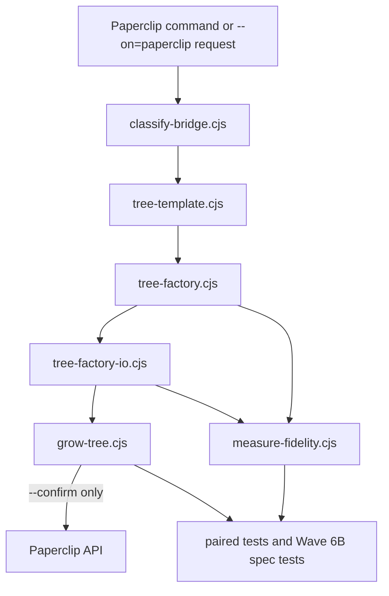

# Design

**Version:** 0.1.0
**Date:** 2026-06-12
**Status:** approved

## 1. Overview

The Paperclip task tree factory is a repo-local design contract for turning Pipeline Orchestrator workflows into Paperclip issue trees. It describes existing runtime-backed modules and the validation expectations around them; it does not create a second implementation path.

The design principle is: **pure flow construction first, injected I/O second, explicit confirmation before mutation, and honest evidence labels at closeout.**

## 2. Architecture

## 3. Decisions

### ADR-001: `tree-template.cjs` Owns Flow Shape

**Status:** Accepted
**Requirements:** REQ-001

Decision: flow families, variants, and node ordering remain declarative data in `tree-template.cjs`.

Rationale: the factory can test and measure flow coverage without scattering workflow shape through command files or docs.

### ADR-002: `tree-factory.cjs` Owns Pure Node Construction

**Status:** Accepted
**Requirements:** REQ-002

Decision: dependency resolution, fan-in joins, and slice expansion stay in pure functions before any Paperclip transport exists.

Rationale: dependency behavior can be tested deterministically and safely.

### ADR-003: Network I/O Is Injected and Confirm-Gated

**Status:** Accepted
**Requirements:** REQ-003, REQ-004

Decision: `tree-factory-io.cjs` receives transport as an argument, and `grow-tree.cjs` performs remote mutation only for confirmed runs.

Rationale: tests can prove dry-run safety and identifier validation without touching the Paperclip server.

### ADR-004: Fidelity Measurement Is Read-Only

**Status:** Accepted
**Requirements:** REQ-005

Decision: `measure-fidelity.cjs` and the public `measure-paperclip-fidelity` skill report evidence without creating Paperclip issues.

Rationale: measuring parity should not mutate remote work queues.

### ADR-005: Claims Are Layered

**Status:** Accepted
**Requirements:** REQ-006

Decision: closeout language must separate repo-only, package-surface, installed-cache, and live Paperclip evidence.

Rationale: local code and tests do not prove a deployed company roster or installed plugin cache was updated.

## 4. Components

### 4.1 Flow Template

**Files:** `references/paperclip/spec/lib/tree-template.cjs`

**Responsibilities:**

- Declare supported Paperclip flow families.
- Preserve compatibility templates separately from current flow families.
- Keep node metadata sufficient for blocking, parallelism, and role assignment.

### 4.2 Pure Factory

**Files:** `references/paperclip/spec/lib/tree-factory.cjs`

**Responsibilities:**

- Resolve next steps.
- Build node specs for linear cards.
- Build fan-in specs from complete step maps.
- Expand implementation slices where supported.

### 4.3 I/O Boundary

**Files:** `references/paperclip/spec/lib/tree-factory-io.cjs`, `references/paperclip/spec/lib/grow-tree.cjs`

**Responsibilities:**

- Validate ids before transport calls.
- Resolve roles from roster data.
- Keep dry-run free of remote mutation.
- Confirm remote success only when an issue id is present.

### 4.4 Fidelity Reporter

**Files:** `references/paperclip/spec/lib/measure-fidelity.cjs`, `skills/measure-paperclip-fidelity/SKILL.md`

**Responsibilities:**

- Measure flow and role coverage from repo evidence.
- Report gaps without mutating Paperclip state.
- Keep output labels honest about evidence layer.

### 4.5 Spec and Regression Surface

**Files:** `.kiro/specs/paperclip-task-tree-factory/**`, `tests/unit/paperclip/**`, `tests/integration/plugin/**`

**Responsibilities:**

- Keep this Kiro spec discoverable for Wave 6B.
- Add tests when spec or public docs mention runtime-backed behavior.
- Preserve the distinction between documentation and runtime truth.

## 5. Validation Strategy

- Existing Paperclip library tests continue to prove pure factory, I/O, CLI, and flow mirror behavior.
- Wave 6B adds a focused spec-surface test proving this Kiro spec exists and names the required contracts.
- Eval Gate records the latest output and telemetry for repo-local evidence.

## 6. Non-Goals

- This spec does not publish the plugin.
- This spec does not update the installed Codex cache.
- This spec does not create Paperclip issues in the VPS.
- This spec does not replace the existing Paperclip flow-mirror runtime modules.
