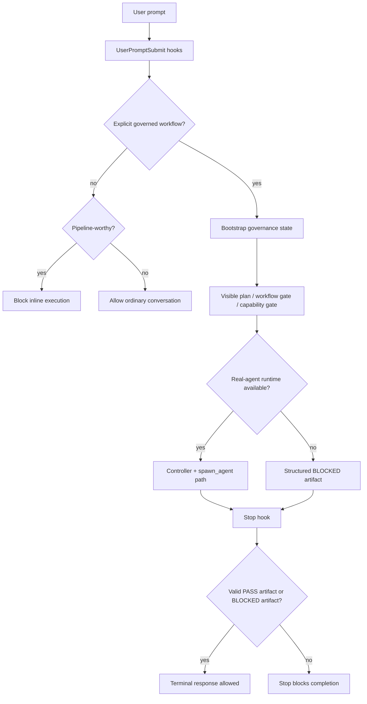

# Design Document: Pipeline Invocation Enforcement

## Overview

This design hardens the Pipeline Orchestrator front door so governed requests cannot silently become inline manual execution. The change is intentionally incremental: it extends existing hooks, controller bootstrap, stores, gate registry, artifact validation and tests.

The design does not create a second orchestrator. Markdown continues to describe the contract; hooks and runtime state enforce it; ledgers and tests prove it.

## Boundary Commitments

### This Spec Owns

- Plugin hook config for invocation enforcement.
- Hook scripts that classify explicit and pipeline-worthy prompts.
- Early governance bootstrap for explicit pipeline requests.
- Stop-time evidence validation for PASS or BLOCKED terminal states.
- Gate taxonomy parity between runtime gates and final artifact validation.
- Focused unit/eval coverage for the escape paths in this spec.
- Reporting boundaries for local validation vs installed cache/runtime adoption.

### This Spec Does Not Own

- Marketplace publication.
- VPS synchronization.
- Full rewrite of the controller.
- Full redesign of all pipeline variants or 45 agent prompts.
- New dependencies.
- Manual edits to `dist/**`.

### Dependencies And Revalidation Triggers

- Official Codex hook or subagent behavior changes require rechecking `references/openai-codex-kb/**` and official docs.
- Any change to hook event names, matcher semantics, or multi-agent feature flags requires focused tests and KB update.
- Any change to required governance artifact fields requires updating `src/domain/pipeline-schemas.ts`, `completion-checklist.cjs`, tests and docs together.

## Architecture



## Components

### Component 1: Hook Config Normalizer

**Files:** `hooks/hooks.json`, new or existing unit test under `tests/unit/hooks/**`.

Responsibilities:

- Replace executable `SessionStart` prompt handler with command handler.
- Keep hook declarations aligned with Codex hook config shape.
- Fail static validation when executable context is configured as `type: "prompt"`.

Interfaces:

- Input: `hooks/hooks.json`.
- Output: trusted hook config containing command-backed `SessionStart`.

Requirements covered: 2.1, 2.2, 2.3, 2.4, 9.1.

### Component 2: SessionStart Context Command

**Files:** new `hooks/session-start-context.cjs` or equivalent.

Responsibilities:

- Emit runtime context for Codex on session start.
- State that explicit pipeline requests require real-agent evidence or `blocked-no-agent-runtime`.
- Avoid writing runtime state during ordinary session start unless explicitly asked by the front-door bootstrap path.

Interfaces:

- Input: Codex SessionStart hook payload.
- Output: JSON hook output with additional context or stdout context accepted by Codex.

Requirements covered: 2.1, 2.2, 2.4, 2.5.

### Component 3: Front-Door Prompt Enforcement

**Files:** `hooks/force-pipeline-agents.cjs`, tests under `tests/unit/hooks/**`.

Responsibilities:

- Preserve trivial-chat allow behavior.
- Detect explicit governed workflows.
- Detect pipeline-worthy prompts.
- Block pipeline-worthy prompts that do not use canonical workflow entry.
- Mark explicit workflow commands as requiring bootstrap and first-action enforcement without blocking the command.

Interfaces:

- Input: UserPromptSubmit payload or raw prompt text.
- Output: `continue:false` for blocked inline execution, `continue:true` for explicit workflow with additional enforcement context, or allow for trivial chat.

Requirements covered: 1.1-1.5, 3.1-3.5, 9.2.

### Component 4: Early Governance Bootstrap

**Files:** `src/controller/pipeline-controller.ts`, `src/security/session-lock.ts`, `src/sentinel/sentinel-state.ts`, possible hook helper module under `hooks/**`.

Responsibilities:

- Create `.codex/pipeline/session-lock.json`, `session.json`, `sentinel-state.json`, and required-first-actions evidence before execution or edits.
- Reuse controller session identifiers when the controller takes ownership.
- Block when state cannot be written.

Interfaces:

- Input: explicit workflow classification plus workspace root.
- Output: state files under `.codex/pipeline/**`.

Requirements covered: 4.1-4.5, 5.1-5.5, 8.5, 9.3.

### Component 5: Capability Gate And Blocked Artifact

**Files:** `src/governance/pipeline-contract.ts`, `src/controller/pipeline-controller.ts`, `src/domain/pipeline-schemas.ts`.

Responsibilities:

- Evaluate real-agent capability availability.
- Return `BLOCKED` artifact when required runtime is unavailable.
- Ensure manual fallback is explicitly not counted as pipeline.

Interfaces:

- Input: runtime capability adapter state.
- Output: `PipelineGovernanceArtifact` or blocked artifact.

Requirements covered: 5.1-5.5, 6.1, 6.4.

### Component 6: Stop Evidence Enforcement

**Files:** `hooks/completion-checklist.cjs`, tests under `tests/unit/hooks/**` or `evals/tests/**`.

Responsibilities:

- Detect explicit pipeline terminal attempts, even when no dispatch call happened.
- Allow only valid PASS artifacts or structured BLOCKED artifacts.
- Block completion without required gates, hook evidence, dispatch evidence, wait-agent evidence or final verdict.

Interfaces:

- Input: Stop hook payload, transcript text, `.codex/pipeline/**` ledgers.
- Output: allow or `continue:false` with sanitized missing-evidence reason.

Requirements covered: 6.1-6.5, 9.4.

### Component 7: Gate Taxonomy Mapper

**Files:** `src/gates/gate-registry.ts`, `src/governance/pipeline-contract.ts`, `hooks/completion-checklist.cjs`, tests.

Responsibilities:

- Define canonical mapping between runtime gates and final artifact required gates.
- Prevent fake PASS evidence by requiring ledger-backed mapping.
- Keep `PLAN_GATE_ACTIVE` naming consistent across TypeScript, prompt-facing docs and tests.

Interfaces:

- Input: runtime gate entries.
- Output: canonical gate evidence set for artifact validation.

Requirements covered: 7.1-7.5, 9.5.

### Component 8: Edit And Dispatch Guard Integration

**Files:** `hooks/dispatch-guard.cjs`, `hooks/sentinel-hook.cjs`, `hooks/edit-guard-hook.cjs`, `hooks/session-lock-hook.cjs`.

Responsibilities:

- Preserve current dispatch identity enforcement.
- Ensure active explicit pipeline lock denies edits without execution window.
- Ensure missing lock during explicit pipeline execution is treated as bootstrap failure.

Interfaces:

- Input: PreToolUse payloads and `.codex/pipeline/**` state.
- Output: allow/deny decisions with sanitized reasons.

Requirements covered: 8.1-8.5.

### Component 9: Test And Eval Coverage

**Files:** `tests/unit/**`, `evals/tests/**`, `evals/outputs/latest_output.md`, `.agents/skills/workflow-eval-gate/scripts/run_eval.py`.

Responsibilities:

- Add focused tests for front-door, hooks, stop enforcement, bootstrap and gate mapping.
- Run local Eval Gate for governed workflow/hook changes.
- Keep validation evidence concrete.

Requirements covered: 9.1-9.6, 10.1.

### Component 10: Closeout Reporter

**Files:** final report only unless existing report helper is extended.

Responsibilities:

- Report local repo validation, generated build, installed cache, global availability and VPS adoption separately.
- Avoid claiming publication/cache/runtime adoption when not verified.

Requirements covered: 10.1-10.5.

## Data Model

### Required First Actions

Potential file: `.codex/pipeline/required-first-actions.json`.

```json
{
  "schema_version": 1,
  "pipeline_requested": true,
  "workflow": "pipeline",
  "created_at": "ISO-8601",
  "required": [
    "visible_plan",
    "workflow_method_gate",
    "capability_gate",
    "controller_dispatch_or_blocked_artifact"
  ],
  "completed": []
}
```

### Blocked Artifact

```json
{
  "pipeline_requested": true,
  "pipeline_valid": false,
  "status": "BLOCKED",
  "runtime_mode": "blocked-no-agent-runtime",
  "missing_capabilities": ["spawn_agent", "wait_agent"],
  "manual_fallback_allowed": true,
  "manual_fallback_counts_as_pipeline": false,
  "gates": [
    {
      "gate": "CAPABILITY_GATE",
      "status": "BLOCKED"
    }
  ]
}
```

### Gate Mapping

```ts
type CanonicalGateMapping = {
  canonicalGate: string;
  acceptedRuntimeGates: string[];
  requiresLedgerEvidence: boolean;
};
```

## File Structure Plan

- `hooks/hooks.json`: replace prompt-backed SessionStart with command-backed SessionStart.
- `hooks/session-start-context.cjs`: emit startup context for explicit pipeline enforcement.
- `hooks/force-pipeline-agents.cjs`: convert pipeline-worthy non-canonical requests from advisory to block.
- `hooks/completion-checklist.cjs`: allow structured BLOCKED artifacts and strengthen explicit request detection.
- `hooks/session-lock-hook.cjs`: optionally share bootstrap helper or remain heartbeat-only if controller owns bootstrap.
- `src/controller/pipeline-controller.ts`: ensure early explicit pipeline state exists before proposal and is reconciled with controller state.
- `src/governance/pipeline-contract.ts`: own artifact construction and capability-gate semantics.
- `src/gates/gate-registry.ts`: own gate mapping or exported canonical registry helpers.
- `src/domain/pipeline-schemas.ts`: validate any new state/artifact shape.
- `tests/unit/hooks/*.test.ts`: focused hook behavior tests.
- `tests/unit/controller/pipeline-controller.test.ts`: bootstrap and blocked artifact tests.
- `tests/unit/gates/*.test.ts`: gate taxonomy parity tests.
- `evals/outputs/latest_output.md`: final eval claim for this implementation when executed.

## Testing Strategy

- **Hook config static test:** verify `SessionStart` executable context uses `type: "command"`.
- **Front-door tests:** trivial chat allowed, explicit workflow allowed with bootstrap context, pipeline-worthy non-canonical prompt blocked.
- **Crash/fail-closed tests:** malformed hook payload on governed enforcement returns sanitized block.
- **Bootstrap tests:** explicit pipeline creates lock, session, sentinel, required-first-actions and gate ledger before proposal.
- **Capability tests:** missing `spawn_agent`/`wait_agent` yields blocked artifact, not inline execution.
- **Stop tests:** terminal PASS without artifact blocks; terminal BLOCKED with `manual_fallback_counts_as_pipeline=false` allows; dispatch omission is caught.
- **Gate parity tests:** all required final artifact gates map to emitted/registered gates with ledger proof.
- **Regression commands:** `npm run lint:types`, focused Vitest files, `npm run build`, relevant `npm test` subset or full suite when feasible, Eval Gate runner.

## Rollout Plan

1. Add static tests first for current failing behavior.
2. Fix hook config and SessionStart context.
3. Harden front-door hook decision.
4. Add/finish early bootstrap evidence.
5. Harden Stop artifact acceptance/blocking.
6. Add gate mapping and parity tests.
7. Run focused checks, build, Eval Gate and report scope boundaries.

## Security Considerations

- Hook deny reasons must stay sanitized and must not leak full local paths, raw prompt payloads, tokens or environment values.
- Shell/edit guard behavior must remain fail-closed under explicit pipeline lock.
- No new dependencies are allowed without approval.
- Hook trust must be reported separately from file presence.

## Design Review Gate

- Requirements coverage: PASS.
- Existing architecture reused: PASS.
- Boundary commitments explicit: PASS.
- File responsibilities concrete: PASS.
- Testing strategy maps to acceptance criteria: PASS.
- No unresolved design gap requiring requirements rewrite: PASS.
