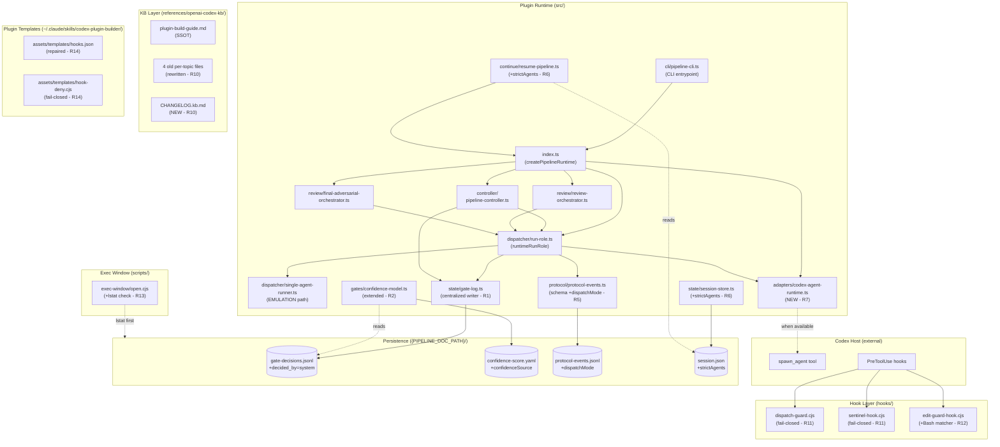
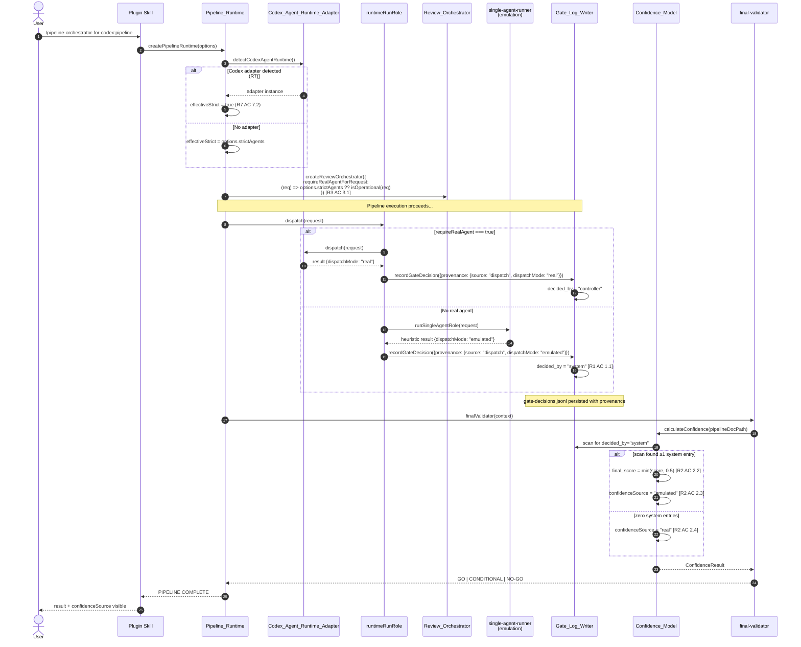

# Technical Design: Pipeline Trust Restoration

## 1. Overview

Esta spec implementa 14 mudanças cirúrgicas no plugin `pipeline-orchestrator-for-codex` para eliminar o "Emulation Theatre" (Padrão C — `Review_Orchestrator` e `Final_Adversarial_Orchestrator` silenciosamente rodam em emulação quando `strictAgents` é undefined, fabricando veredictos indistinguíveis de revisão real). O design opera em três layers: (a) **provenance** — centralizar o write de `gate-decisions.jsonl` e marcar `decided_by='system'` para emulação; (b) **penalty** — cap de confidence em 0.5 quando há provenance emulada; (c) **enforcement** — alinhar review/final-adversarial orchestrators à cascade segura de `runtimeRunRole` (3 linhas em `src/index.ts`). Inclui também 4 fixes estruturais (Theme B — Authority Fragmentation: pipeline-controller authority, gate hardness SSOT, KB SSOT) e um cluster de 4 fixes de segurança (hooks fail-closed, Bash bypass, symlink resistance, plugin templates).

## 2. Architecture Diagram



## 3. Components & File Mapping

### 3.1 Component: Gate_Log_Writer

| Atributo | Valor |
| --- | --- |
| **Arquivo** | `src/state/gate-log.ts` (estender) + remove hardcodes em `src/index.ts:45,967` + outros call sites |
| **Linhas existentes** | atomic write já existe; falta API centralizada |
| **Grep para localizar** | `grep -rn "decided_by" src/` |
| **Requirement(s)** | R1 (Distinguishable Emulated Dispatches) |

**Interface Contract:**

```typescript
// src/state/gate-log.ts
export type DecidedBy = "controller" | "user" | "system" | "resume-router";
export type DispatchMode = "real" | "emulated";

export interface GateDecisionEntry {
  gate: string;
  hardness: "MANDATORY" | "HARD" | "CIRCUIT_BREAKER" | "SOFT";
  phase: string;
  decision: string;
  decided_by: DecidedBy;
  timestamp: string;
  detail: string;
  confidence_impact: number;
}

export interface RecordGateInput {
  pipelineDocPath: string;
  gate: string;
  phase: string;
  decision: string;
  detail: string;
  confidence_impact?: number;
  // Provenance — caller passes context, writer infers decided_by
  provenance:
    | { source: "user" }
    | { source: "resume-router" }
    | { source: "dispatch"; dispatchMode: DispatchMode };
}

export function recordGateDecision(input: RecordGateInput): Promise<void>;
```

**Responsabilidades:**

1. Único módulo autorizado a escrever em `gate-decisions.jsonl`.
2. Inferir `decided_by` da `provenance` (`dispatch + dispatchMode='emulated'` → `'system'`; `dispatch + dispatchMode='real'` → `'controller'`; outros mapeados diretamente).
3. Validar via Zod a entry inteira antes do append.
4. Usar `src/state/atomic-write.ts` (já existe) para append seguro.
5. Truncar `detail` a 200 chars + strip `\n`/`\r` (inline invariant do controller spec).

### 3.2 Component: Confidence_Model

| Atributo | Valor |
| --- | --- |
| **Arquivo** | `src/gates/confidence-model.ts` |
| **Linhas existentes** | 39-65 (cálculo aritmético atual) |
| **Grep para localizar** | `grep -n "createConfidenceModel\|final_score" src/gates/confidence-model.ts` |
| **Requirement(s)** | R2 (Confidence Score Reflects Emulation Presence) |

**Interface Contract:**

```typescript
// Extender o output existente
export interface ConfidenceResult {
  final_score: number;             // capped per R2 AC 2.2
  classification_clarity: number;
  info_completeness: number;
  // ... outros dimensions existentes
  confidenceSource: "real" | "emulated";   // NEW per R2 AC 2.3/2.4
  emulated_entry_count: number;             // NEW for logging per R2 AC 2.5
}

// Nova função interna
function scanForEmulatedEntries(pipelineDocPath: string): number;
```

**Responsabilidades:**

1. Após cálculo aritmético, escanear `gate-decisions.jsonl` da run por entries com `decided_by === 'system'`.
2. Se count > 0: cap `final_score` em `Confidence_Cap_Threshold` (constante = 0.5) e setar `confidenceSource: 'emulated'`.
3. Se count === 0: setar `confidenceSource: 'real'`, sem cap.
4. Logar decisão (cap aplicado ou não, count de emulated entries) em formato structured.
5. Performance: scan O(N) com early return possível se já encontrou ≥1 system entry (otimização opcional).

### 3.3 Component: Pipeline_Runtime (cascade fix)

| Atributo | Valor |
| --- | --- |
| **Arquivo** | `src/index.ts` |
| **Linhas existentes** | 691 (createReviewOrchestrator), 699-701 (createFinalAdversarialOrchestrator) |
| **Grep para localizar** | `grep -n "createReviewOrchestrator\|createFinalAdversarialOrchestrator" src/index.ts` |
| **Requirement(s)** | R3 (Review Orchestrators Inherit Safe Cascade) |

**Diff Contract** (3 linhas):

```typescript
// ANTES (src/index.ts:691)
const runtimeReviewOrchestrator = createReviewOrchestrator({
  runRole: runtimeRunRole,
  requireRealAgent: options.strictAgents === true,   // <— wrong: undefined → false
});

// DEPOIS (R3 AC 3.1)
const runtimeReviewOrchestrator = createReviewOrchestrator({
  runRole: runtimeRunRole,
  requireRealAgent:
    options.strictAgents ?? isOperationalPipelineDispatch(<dispatch_context>),
});
```

Aplicar mesmo padrão em `createFinalAdversarialOrchestrator` (linhas 699-701).

**Open issue para spec-tasks:** o `<dispatch_context>` precisa ser injetado consistentemente. Atualmente line 548 usa `request` que é parâmetro do `runtimeRunRole`. Aqui, no momento de criar os orchestrators (linha 691), `request` não está disponível — é por isso que o código original simplificou para `=== true`. **Solução:** capturar `options` no closure e re-resolver `requireRealAgent` por-dispatch dentro do orchestrator (lazy resolution), não na criação.

**Refined interface:**

```typescript
// src/review/review-orchestrator.ts (modificação)
export interface ReviewOrchestratorDeps {
  runRole: RunRoleFn;
  // ANTES: requireRealAgent: boolean
  // DEPOIS:
  requireRealAgentForRequest: (request: DispatchRequest) => boolean;
}
```

E `src/index.ts:691` passa:

```typescript
requireRealAgentForRequest: (request) =>
  options.strictAgents ?? isOperationalPipelineDispatch(request),
```

Isso preserva semântica e mantém a cascata segura.

### 3.4 Component: Test_Suite_StrictAgentsUndefined

| Atributo | Valor |
| --- | --- |
| **Arquivo** | `tests/integration/strict-agents-undefined.test.ts` (NEW) |
| **Linhas existentes** | N/A (novo arquivo) |
| **Grep para localizar** | `grep -rn "strictAgents" tests/` |
| **Requirement(s)** | R4 (Test Coverage for strictAgents=undefined Path) |

**Estrutura:**

```typescript
// tests/integration/strict-agents-undefined.test.ts
// Spec: R4 / G-P1-2
// Covers: R4 AC 4.1, 4.2, 4.3

describe("strictAgents=undefined production-default path", () => {
  it("AC 4.1: review-orchestrator without agentRuntime → decided_by='system' in gate-log", async () => {
    const runtime = createPipelineRuntime({});  // no strictAgents
    // ... spawn review path, inspect gate-log
    expect(entries.some(e => e.decided_by === "system")).toBe(true);
  });

  it("AC 4.2: final-adversarial-orchestrator symmetric to 4.1", async () => { /* ... */ });

  it("AC 4.3: confidence final_score ≤ 0.5 when at least one decided_by='system'", async () => { /* ... */ });
});
```

**Responsabilidades:**

1. 3 cenários BDD-style cobrindo R4 ACs 4.1, 4.2, 4.3.
2. Header comment declarando `R4` + AC numbers (R4 AC 4.5).
3. Deterministic (no flaky behavior) — R4 AC 4.4.
4. Wired em `npm test` via `tests/integration/**` glob (já configurado em `vitest.config.ts`).

### 3.5 Component: Protocol_Event_Writer

| Atributo | Valor |
| --- | --- |
| **Arquivo** | `src/protocol/protocol-events.ts` (schema) + writer call sites |
| **Linhas existentes** | 62-117 (Zod schema atual) |
| **Grep para localizar** | `grep -n "ProtocolEventSchema\|appendProtocolEvent" src/protocol/` |
| **Requirement(s)** | R5 (Post-Mortem Distinguishability in Protocol Events) |

**Schema patch:**

```typescript
// src/protocol/protocol-events.ts
export const protocolEventSchema = z.object({
  event_id: z.string(),
  kind: z.enum(["GATE_REQUEST", "DISPATCH_REQUEST", "PLAN_MODE_REQUEST"]),
  protocol_version: z.literal("v1"),
  status: z.string(),
  source: z.string(),
  timestamp: z.string(),
  payload: z.record(z.unknown()),
  execution_identity: z.string().optional(),
  // NEW per R5 AC 5.2
  dispatchMode: z.enum(["real", "emulated"]).optional(),
});
```

**Writer extension:**

```typescript
// Caller injeta dispatchMode no payload com base em agentRuntime presence
export function recordDispatchEvent(input: {
  // ...
  dispatchMode: DispatchMode;
}): Promise<void>;
```

**Backward compat (R5 AC 5.5):** parser de leitura aceita ausência do campo e tagga como `'unknown'` em qualquer downstream report.

### 3.6 Component: Resume_Pipeline_StrictAgents_Persistence

| Atributo | Valor |
| --- | --- |
| **Arquivo** | `src/continue/resume-pipeline.ts` + `src/controller/continue-state.ts` + `src/state/session-store.ts` |
| **Linhas existentes** | `resume-pipeline.ts:1-16`, `continue-state.ts:118-143` |
| **Grep para localizar** | `grep -rn "session.json\|strictAgents" src/continue/ src/state/session-store.ts` |
| **Requirement(s)** | R6 (Resume Preserves strictAgents) |

**Session schema patch:**

```typescript
// src/state/session-store.ts
export interface PersistedSession {
  // ... campos existentes
  strictAgents?: boolean;   // NEW per R6 AC 6.1 (opcional para backward-compat per AC 6.3)
}
```

**Resume resolver patch:**

```typescript
// src/continue/resume-pipeline.ts
export async function resumePipeline(options: ResumeOptions) {
  const persisted = await loadSession(options.sessionId);
  return runPipeline({
    ...options,
    strictAgents: persisted.strictAgents ?? options.strictAgents,  // R6 AC 6.2
    // legacy session (sem campo) → undefined → cascade aplica (AC 6.3)
  });
}
```

### 3.7 Component: Codex_Agent_Runtime_Adapter (NEW)

| Atributo | Valor |
| --- | --- |
| **Arquivo** | `src/adapters/codex-agent-runtime.ts` (NEW) |
| **Linhas existentes** | N/A (novo arquivo) |
| **Grep para localizar** | `grep -rn "AgentRuntimeAdapter" src/` |
| **Requirement(s)** | R7 (Native Codex agentRuntime Adapter) |

**Interface Contract:**

```typescript
// src/adapters/codex-agent-runtime.ts (NEW)
import type { AgentRuntimeAdapter, DispatchRequest, DispatchResult } from "../dispatcher/types.js";

export interface CodexAgentRuntimeOptions {
  spawnAgent: (input: { fqn: string; message: string }) => Promise<{ output: unknown }>;
  detectionMode?: "auto" | "manual";
}

export function createCodexAgentRuntimeAdapter(
  options: CodexAgentRuntimeOptions,
): AgentRuntimeAdapter {
  return {
    async dispatch(request: DispatchRequest): Promise<DispatchResult> {
      // R7 AC 7.3: invoca real spawn_agent
      const result = await options.spawnAgent({
        fqn: buildFqn(request),  // pipeline-orchestrator-for-codex:<folder>:<leaf>
        message: serializeRequest(request),
      });
      return parseAgentOutput(result.output, request);
    },
  };
}

// Detector (chamado em createPipelineRuntime)
export function detectCodexAgentRuntime(): CodexAgentRuntimeOptions | null {
  // R7 AC 7.1: detecta se spawn_agent está disponível no ambiente Codex
  if (typeof globalThis.spawn_agent === "function") {
    return { spawnAgent: globalThis.spawn_agent, detectionMode: "auto" };
  }
  // Outras heurísticas (env var CODEX_HOST, etc.)
  return null;
}
```

**Integration em `src/index.ts:474` (createPipelineRuntime):**

```typescript
export function createPipelineRuntime(options: RuntimeOptions = {}) {
  // R7 AC 7.2: default strictAgents to true when adapter detected
  const detectedAdapter = options.agentRuntime ?? detectCodexAgentRuntime();
  const effectiveStrict =
    options.strictAgents ?? (detectedAdapter !== null ? true : undefined);

  if (effectiveStrict !== options.strictAgents) {
    // R7 AC 7.5: one-time warning if opting out
    logger.info("[trust-restoration] Codex adapter detected; strictAgents defaulted to true");
  }
  // ... resto do código
}
```

### 3.8 Component: Pipeline_Controller_Authority_Note

| Atributo | Valor |
| --- | --- |
| **Arquivo** | `agents/core/pipeline-controller.md` |
| **Linhas existentes** | 1-20 (frontmatter + opening lines) |
| **Grep para localizar** | `grep -n "^---\|sole orchestrator" agents/core/pipeline-controller.md` |
| **Requirement(s)** | R8 (Pipeline Controller Authority Resolution) |

**Patch — adicionar AUTHORITY_NOTE header após o frontmatter:**

```markdown
---
name: pipeline-controller
description: Pipeline controller — primary orchestration role for /pipeline-orchestrator-for-codex:pipeline workflow. SSOT operacional: src/controller/pipeline-controller.ts.
tools: Read, Write, Glob, Grep, Skill
model: gpt-4o
color: red
---

> **AUTHORITY_NOTE (2026-05-19):**
> Esta especificação markdown documenta o contrato conceitual do pipeline-controller para
> leitores humanos. **O SSOT operacional é `src/controller/pipeline-controller.ts`** (1885 linhas)
> — esse é o módulo que efetivamente executa quando o plugin é invocado via CLI ou via skill
> em ambientes sem real `spawn_agent` adapter.
>
> Quando um real `Codex_Agent_Runtime_Adapter` está disponível (per R7), este markdown PODE
> ser carregado como mensagem do N1 spawn — nesse caso, ambos artefatos convergem para o
> mesmo contrato. Sem o adapter, este arquivo é referência de design; não tente reconciliar
> divergências contra ele lendo-o como código.
>
> Mudanças funcionais devem ser feitas no TypeScript (SSOT); mudanças em design / fluxo conceitual
> devem ser feitas aqui — e refletidas no TS na mesma PR.

# Pipeline Controller (v4 N1 orchestrator)
```

**Responsabilidades adicionais:**

1. Atualizar frontmatter `description` removendo "Dispatches 37 N2 agents" stale claim (R8 AC 8.5).
2. Manter o corpo do prompt como referência humana — não deletar.

### 3.9 Component: Gate_Hardness_Registry_Unification

| Atributo | Valor |
| --- | --- |
| **Arquivo** | `src/gates/gate-registry.ts` (modificar) + `src/gates/hardness-policy.ts` (remover ou demoter) |
| **Linhas existentes** | gate-registry 15-225 (literais); hardness-policy 3-20 (utility) |
| **Grep para localizar** | `grep -rn "classifyGateHardness\|hardness:" src/gates/` |
| **Requirement(s)** | R9 (Single Authority for Gate Hardness) |

**Escolha:** Option (a) — `gate-registry.ts` é SSOT com literais; `hardness-policy.ts` é demoted para test utility.

**Patch em `hardness-policy.ts`:**

```typescript
// src/gates/hardness-policy.ts
/**
 * DEMOTED (per R9 / spec pipeline-trust-restoration):
 * This utility is retained as a TEST cross-check tool.
 * The canonical hardness source is `src/gates/gate-registry.ts` (literal field per entry).
 * CI test `gate-hardness-consistency.test.ts` uses this utility to validate
 * that registry literals match the implied classification rules.
 */
export function classifyGateHardness(/* ... */): GateHardness {
  // ... unchanged logic, but now used only by tests
}
```

**Novo test:**

```typescript
// tests/unit/gates/gate-hardness-consistency.test.ts
// Spec: R9 AC 9.4
import { GATE_REGISTRY } from "../../../src/gates/gate-registry";
import { classifyGateHardness } from "../../../src/gates/hardness-policy";

describe("Gate hardness registry consistency", () => {
  for (const [name, entry] of Object.entries(GATE_REGISTRY)) {
    it(`${name}: registry literal hardness matches classifier`, () => {
      const computed = classifyGateHardness({
        blocker: entry.defaultDecision === "block",
        severity: entry.severity ?? "medium",
      });
      expect(entry.hardness).toBe(computed);
    });
  }
});
```

### 3.10 Component: KB_Codex_SSOT_Consolidation

| Atributo | Valor |
| --- | --- |
| **Arquivo** | `references/openai-codex-kb/plugins.md`, `skills.md`, `agents-and-subagents.md`, `rules-hooks-agents-md.md` + new `CHANGELOG.kb.md` |
| **Linhas existentes** | bottom-appended Drift Notes em cada um dos 4 arquivos antigos |
| **Grep para localizar** | `grep -n "Drift Notes" references/openai-codex-kb/*.md` |
| **Requirement(s)** | R10 (KB Codex SSOT Consolidation) |

**Escolha:** Option (a) — reescrever bodies dos 4 arquivos antigos para refletir o estado corrigido; remover seções Drift Notes; mover conteúdo dessas seções para `CHANGELOG.kb.md`.

**Process:**

1. Para cada um dos 4 arquivos: identificar afirmações stale na parte de cima; reescrever inline com a versão correta (que já está no `plugin-build-guide.md`).
2. Remover seção `## Drift Notes (2026-05-19)` ao final.
3. Atualizar `last_verified` frontmatter para `2026-05-19` (uniforme).
4. Apender conteúdo das 4 Drift Notes em novo arquivo `references/openai-codex-kb/CHANGELOG.kb.md`:

```markdown
# KB Codex Changelog

## 2026-05-19

### plugins.md
[conteúdo da Drift Notes movido aqui]

### skills.md
[conteúdo da Drift Notes movido aqui]

### agents-and-subagents.md
[conteúdo da Drift Notes movido aqui]

### rules-hooks-agents-md.md
[conteúdo da Drift Notes movido aqui]
```

### 3.11 Component: Hook_FailClosed_DispatchGuard_And_SentinelHook

| Atributo | Valor |
| --- | --- |
| **Arquivo** | `hooks/dispatch-guard.cjs` + `hooks/sentinel-hook.cjs` |
| **Linhas existentes** | dispatch-guard 391-402; sentinel-hook 108-112, 181-184 |
| **Grep para localizar** | `grep -n "catch\|exit 0\|allow" hooks/dispatch-guard.cjs hooks/sentinel-hook.cjs` |
| **Requirement(s)** | R11 (Hooks Fail Closed on Internal Exception) |

**Patch pattern (aplicar nos dois hooks):**

```javascript
// hooks/dispatch-guard.cjs (linhas 391-402 — fluxo principal)
try {
  // ... lógica existente de evaluate
  return resultDecision;
} catch (err) {
  // R11 AC 11.1, 11.4 — fail-closed + sanitized reason
  console.error("[dispatch-guard] internal error", err);  // stderr OK, not in user-facing
  return {
    hookSpecificOutput: {
      hookEventName: "PreToolUse",
      permissionDecision: "deny",
      permissionDecisionReason: "hook internal error — failing closed",
    },
  };
}
```

Mesmo padrão em `sentinel-hook.cjs:108-112,181-184` (e adicionar para o branch de corrupted state — R11 AC 11.3).

### 3.12 Component: Edit_Guard_Hook_Bash_Coverage

| Atributo | Valor |
| --- | --- |
| **Arquivo** | `hooks/hooks.json` + `hooks/edit-guard-hook.cjs` |
| **Linhas existentes** | hooks.json:85 (matcher); edit-guard-hook.cjs:24 (logic) |
| **Grep para localizar** | `grep -n "Edit\|Write\|Bash" hooks/hooks.json hooks/edit-guard-hook.cjs` |
| **Requirement(s)** | R12 (Bash Tool Coverage in Edit Guard) |

**Patch em hooks.json:**

```json
{
  "matcher": "Edit|Write|NotebookEdit|MultiEdit|Bash",
  "hooks": [
    { "type": "command", "command": "node \"${CODEX_PLUGIN_ROOT}/hooks/edit-guard-hook.cjs\"" }
  ]
}
```

**Patch em edit-guard-hook.cjs (parse logic):**

```javascript
function evaluateBashCommand(command, allowedScope) {
  // R12 AC 12.2 — parse for write/destructive operators
  const writeRedirect = /(\s|^)([>]{1,2})\s*([^\s]+)/g;
  const rmOrMv = /\b(rm|mv)\s+(-[a-z]+\s+)?([^\s]+)/g;

  for (const match of command.matchAll(writeRedirect)) {
    const target = match[3];
    if (!isPathAllowed(target, allowedScope)) {
      return { deny: true, reason: `write redirect '${match[2]}' to ${target} outside allowed scope` };
    }
  }
  for (const match of command.matchAll(rmOrMv)) {
    const target = match[3];
    if (!isPathAllowed(target, allowedScope)) {
      return { deny: true, reason: `${match[1]} on ${target} outside allowed scope` };
    }
  }
  // R12 AC 12.4 — read-only or in-scope → allow
  return { deny: false };
}
```

**Open issue para spec-tasks (do research.md):** confirmar se `Bash` é o tool name canônico no Codex 2026.

### 3.13 Component: Exec_Window_Symlink_Resistance

| Atributo | Valor |
| --- | --- |
| **Arquivo** | `scripts/exec-window/open.cjs` |
| **Linhas existentes** | 81, 95 (renameSync sites) |
| **Grep para localizar** | `grep -n "renameSync\|lstat" scripts/exec-window/` |
| **Requirement(s)** | R13 (Exec Window Resists Symlink Attack) |

**Patch (aplicar em ambos sites 81 e 95):**

```javascript
const fs = require("node:fs");

function safeRenameSync(src, dest) {
  // R13 AC 13.1 — lstat first
  if (fs.existsSync(dest)) {
    const stats = fs.lstatSync(dest);
    if (stats.isSymbolicLink()) {
      // R13 AC 13.2, 13.3 — abort + structured error
      const err = new Error(`SymlinkRefusedError: refusing to renameSync over symlink at ${dest}`);
      err.code = "SYMLINK_REFUSED";
      auditLog({ event: "symlink-refused", target: dest });
      throw err;
    }
  }
  // R13 AC 13.4 — no symlink → proceed
  fs.renameSync(src, dest);
}
```

### 3.14 Component: Plugin_Templates_Repair

| Atributo | Valor |
| --- | --- |
| **Arquivo** | `C:/Users/win/.claude/skills/codex-plugin-builder/assets/templates/hooks.json` + `hook-deny.cjs` + `build-checklist.md` |
| **Linhas existentes** | hook-deny.cjs:51-54 (catch — já corrigido pelo C2 fix anterior nesta sessão); hooks.json (já corrigido pelo C1 fix anterior) |
| **Grep para localizar** | `ls C:/Users/win/.claude/skills/codex-plugin-builder/assets/templates/` |
| **Requirement(s)** | R14 (Plugin Templates Are Copy-Paste-Safe) |

**Status:** **JÁ CORRIGIDO nesta sessão** durante a aplicação de C1+C2+C3 após o adversarial review do skill. Esta spec apenas formaliza os fixes e adiciona o item no checklist (R14 AC 14.5).

**Verificar:**

```bash
ls "C:/Users/win/.claude/skills/codex-plugin-builder/assets/templates/"
# Esperado: hook-deny.cjs (fail-closed default), hooks.json (single-wire), plugin.json,
#           SKILL.md, subagent.toml, marketplace.json — sem refs ghost.
```

**Adicionar AC 14.5 item ao build-checklist.md:**

```markdown
- [ ] Every `command` value in `hooks.json` resolves to a file that actually exists in the templates directory (verify by listing the dir).
```

(Já adicionado parcialmente; revisar para garantir fraseamento exato.)

## 4. Data Flow



## 5. State Changes

| Estado | Antes (pré-fix) | Depois (pós-fix) | Trigger |
| --- | --- | --- | --- |
| `gate-decisions.jsonl[entry].decided_by` para emulação | `"controller"` (mentira) | `"system"` (verdade) | dispatch emulado completa |
| `gate-decisions.jsonl[entry].decided_by` para real | `"controller"` | `"controller"` (preservado) | dispatch real completa |
| `confidence-score.yaml.final_score` quando há emulação | qualquer ≤1.0 | `min(score, 0.5)` | confidence-model scan |
| `confidence-score.yaml.confidenceSource` | (campo não existe) | `"real"` ou `"emulated"` | confidence-model decide |
| `protocol-events.jsonl[event].dispatchMode` | (campo não existe) | `"real"` ou `"emulated"` | dispatch writer |
| `session.json.strictAgents` | (campo não existe) | persistido per session | session save |
| `Review_Orchestrator.requireRealAgentForRequest` | `boolean` fixo | `(req) => boolean` (lazy) | createReviewOrchestrator |
| `agents/core/pipeline-controller.md` header | apenas frontmatter | + `AUTHORITY_NOTE` block | doc edit |
| `references/openai-codex-kb/*.md` bottom | `## Drift Notes` block | corrected body, no addendum | KB rewrite |

## 6. Error Handling

| Erro | Detecção | Tratamento | Visibilidade |
| --- | --- | --- | --- |
| Dispatch provenance indeterminada (R1 AC 1.3) | Validation no `Gate_Log_Writer` | Refuse write + throw structured error | Logs + stderr |
| `agentRuntime` ausente quando strict (R3 AC 3.3, R7 AC 7.4) | check em `runRole` | Throw `AgentRuntimeUnavailableError` | User sees `blocked-no-agent-runtime` |
| Hook internal exception (R11) | try/catch em handler | Emit `permissionDecision: deny` + sanitized reason | User sees deny + reason |
| Corrupted sentinel-state.json (R11 AC 11.3) | JSON parse failure | Fail-closed deny para non-bootstrap agents | User sees deny |
| Symlink at exec-window target (R13) | `lstat.isSymbolicLink()` | Throw `SymlinkRefusedError` + audit log | Caller sees structured error |
| Bash deny by edit-guard (R12) | parse de comando | Emit `permissionDecision: deny` + reason naming operator | User sees deny + reason |
| Legacy protocol-events entry sem dispatchMode (R5 AC 5.5) | parser tolerance | Tag as `'unknown'` em report | downstream reports |
| Legacy session sem strictAgents (R6 AC 6.3) | optional field | Treat as `undefined`, aplicar cascade | Transparent |

## 7. Testing Strategy

| Tipo | Arquivo | O que testar |
| --- | --- | --- |
| Unit | `tests/unit/state/gate-log.test.ts` (NEW) | `recordGateDecision()` provenance → decided_by mapping (R1) |
| Unit | `tests/unit/gates/confidence-model.test.ts` (estender) | Cap aplicado se há entry system (R2) |
| Unit | `tests/unit/protocol/protocol-events.test.ts` (estender) | Zod schema aceita `dispatchMode` opcional (R5) |
| Unit | `tests/unit/gates/gate-hardness-consistency.test.ts` (NEW — R9 AC 9.4) | Registry literals match classifier output |
| Integration | `tests/integration/strict-agents-undefined.test.ts` (NEW) | 3 cenários R4 ACs 4.1-4.3 |
| Integration | `tests/integration/resume-strict-agents.test.ts` (NEW) | R6 AC 6.5 — resume preserves strictAgents |
| Integration | `tests/integration/adapter-detection.test.ts` (NEW) | R7 ACs 7.1, 7.2 — adapter detection + default |
| Integration | `tests/integration/hook-fail-closed.test.ts` (NEW) | R11 AC 11.5 — corrupted payload → deny |
| Integration | `tests/integration/bash-edit-guard.test.ts` (NEW) | R12 AC 12.5 — `Bash > unauthorized` denied |
| Integration | `tests/integration/exec-window-symlink.test.ts` (NEW) | R13 AC 13.5 — pre-created symlink aborts rename |
| Lint | ESLint custom rule (NEW — R1 AC 1.5) | Hardcoded `decided_by` literals forbidden outside `gate-log.ts` |
| Lint | KB consistency check (NEW — R10 AC 10.2) | `last_verified` uniform across KB files |
| Lint | Template file existence (NEW — R14 AC 14.1) | hooks.json `command` paths resolve |

**Total novo:** 9 test files + 3 lint rules. Estimativa: ~25 unit test cases, ~15 integration scenarios.

## 8. Requirement Traceability

| Requirement | Componente(s) | Arquivo(s) |
| --- | --- | --- |
| R1 — Distinguishable Emulated Dispatches | Gate_Log_Writer | `src/state/gate-log.ts`, `src/index.ts:45,920-967` |
| R2 — Confidence Reflects Emulation | Confidence_Model | `src/gates/confidence-model.ts:39-65` |
| R3 — Review Orchestrators Inherit Cascade | Pipeline_Runtime, Review_Orchestrator, Final_Adversarial_Orchestrator | `src/index.ts:691,699-701`, `src/review/review-orchestrator.ts`, `src/review/final-adversarial-orchestrator.ts` |
| R4 — Test Coverage strictAgents=undefined | Test_Suite_StrictAgentsUndefined | `tests/integration/strict-agents-undefined.test.ts` (NEW) |
| R5 — Post-Mortem Distinguishability | Protocol_Event_Writer | `src/protocol/protocol-events.ts:62-117` |
| R6 — Resume Preserves strictAgents | Resume_Pipeline_StrictAgents_Persistence | `src/continue/resume-pipeline.ts`, `src/state/session-store.ts` |
| R7 — Native Codex agentRuntime Adapter | Codex_Agent_Runtime_Adapter | `src/adapters/codex-agent-runtime.ts` (NEW), `src/index.ts:474` |
| R8 — Pipeline Controller Authority | Pipeline_Controller_Authority_Note | `agents/core/pipeline-controller.md:1-20` |
| R9 — Single Authority for Gate Hardness | Gate_Hardness_Registry_Unification | `src/gates/gate-registry.ts`, `src/gates/hardness-policy.ts` |
| R10 — KB Codex SSOT Consolidation | KB_Codex_SSOT_Consolidation | `references/openai-codex-kb/*.md` + `CHANGELOG.kb.md` (NEW) |
| R11 — Hooks Fail Closed | Hook_FailClosed_DispatchGuard_And_SentinelHook | `hooks/dispatch-guard.cjs:391-402`, `hooks/sentinel-hook.cjs:108-184` |
| R12 — Bash Coverage Edit Guard | Edit_Guard_Hook_Bash_Coverage | `hooks/hooks.json:85`, `hooks/edit-guard-hook.cjs:24` |
| R13 — Exec Window Symlink Resistance | Exec_Window_Symlink_Resistance | `scripts/exec-window/open.cjs:81,95` |
| R14 — Plugin Templates Safe | Plugin_Templates_Repair | `~/.claude/skills/codex-plugin-builder/assets/templates/*` (out-of-repo) |

**Cobertura:** 14/14 requirements mapeados, 14 componentes, 22+ arquivos tocados. ✅

## Property Reflection

| ACs Originais | Property Consolidada | Razão |
| --- | --- | --- |
| R1 AC 1.1, R1 AC 1.2, R5 AC 5.3, R5 AC 5.4 | **P1: Provenance Determinism** | Todos são facetas da regra "dispatchMode determina o que vai no log" — mesma invariância em duas tabelas (gate-log e protocol-events). |
| R3 AC 3.1, R3 AC 3.2, R7 AC 7.4 | **P2: Cascade Equivalence** | Mesma resolução de `requireRealAgent` deve ser consistente entre todos os pontos de entrada de dispatch. |
| R2 AC 2.2, R2 AC 2.3, R2 AC 2.4 | **P3: Confidence Honesty** | Trio que define mecânica única do cap (presença de system entry ⇒ cap + tag). |
| R11 AC 11.1, R11 AC 11.2 | **P4: Hook Fail-Closed Universality** | Mesma regra defensiva em dois hooks diferentes — uma property só. |
| R6 AC 6.2, R6 AC 6.4 | **P5: Resume Idempotence on strictAgents** | Idempotência sobre múltiplos resumes. |

## Correctness Properties

### Property 1: Provenance Determinism

**For any** `DispatchResult` produced by `runtimeRunRole`, the `Gate_Log_Writer` SHALL write an entry where `decided_by === "system"` if `dispatchMode === "emulated"` AND `decided_by ∈ {"controller", "user"}` if `dispatchMode === "real"`.

**Validates:** R1 AC 1.1, R1 AC 1.2, R5 AC 5.3, R5 AC 5.4
**Pattern:** Invariant
**Test approach:**

```typescript
import fc from "fast-check";
fc.assert(
  fc.property(
    fc.record({
      dispatchMode: fc.constantFrom("real", "emulated"),
      // ... outros campos
    }),
    (result) => {
      const entry = recordGateDecision({
        provenance: { source: "dispatch", dispatchMode: result.dispatchMode },
        // ...
      });
      if (result.dispatchMode === "emulated") return entry.decided_by === "system";
      else return entry.decided_by === "controller" || entry.decided_by === "user";
    },
  ),
);
```

### Property 2: Cascade Equivalence

**For any** `DispatchRequest`, the `requireRealAgent` resolved at `runtimeRunRole` (src/index.ts:548), `Review_Orchestrator` (per R3 AC 3.1), and `Final_Adversarial_Orchestrator` (per R3 AC 3.2) SHALL be identical when given the same `options` and `request`.

**Validates:** R3 AC 3.1, R3 AC 3.2, R7 AC 7.4
**Pattern:** Invariant (consistency across multiple sites)
**Test approach:**

```typescript
fc.assert(
  fc.property(
    fc.record({
      strictAgents: fc.option(fc.boolean()),
      requestPrompt: fc.string(),
    }),
    ({ strictAgents, requestPrompt }) => {
      const req = makeDispatchRequest({ input: { request: requestPrompt } });
      const fromRunRole = resolveRequireRealAgent_RunRole({ strictAgents }, req);
      const fromReview = resolveRequireRealAgent_Review({ strictAgents }, req);
      const fromFinalAdv = resolveRequireRealAgent_FinalAdv({ strictAgents }, req);
      return fromRunRole === fromReview && fromReview === fromFinalAdv;
    },
  ),
);
```

### Property 3: Confidence Monotonicity

**For any** sequence of gate-log entries G, adding an entry with `decided_by="system"` to G SHALL produce a final_score `≤` the final_score computed over G (never higher).

**Validates:** R2 AC 2.2 (cap), R2 AC 2.3 (mark)
**Pattern:** Metamorphic (relation between input and output)
**Test approach:**

```typescript
fc.assert(
  fc.property(
    fc.array(arbGateEntry(), { minLength: 1, maxLength: 50 }),
    (entries) => {
      const scoreBefore = computeConfidence(entries).final_score;
      const entriesWithSystem = [...entries, arbGateEntry({ decided_by: "system" })];
      const scoreAfter = computeConfidence(entriesWithSystem).final_score;
      return scoreAfter <= scoreBefore;
    },
  ),
);
```

### Property 4: Hook Fail-Closed Universality

**For any** input that triggers an exception in `dispatch-guard.cjs` or `sentinel-hook.cjs` handler, the hook output SHALL contain `permissionDecision: "deny"`.

**Validates:** R11 AC 11.1, R11 AC 11.2
**Pattern:** Error (invalid inputs generate error)
**Test approach:**

```typescript
fc.assert(
  fc.asyncProperty(
    fc.oneof(fc.constant(""), fc.constant("{"), fc.string()),  // malformed JSON inputs
    async (input) => {
      const output = await invokeHookWithStdin("dispatch-guard.cjs", input);
      if (output.didThrow) return output.permissionDecision === "deny";
      return true;  // valid input — irrelevant for this property
    },
  ),
);
```

### Property 5: Resume Idempotence on strictAgents

**For any** persisted session S with a strictAgents value V, calling resume(S) N times in sequence SHALL preserve the strictAgents value V across all resumes (idempotent).

**Validates:** R6 AC 6.4
**Pattern:** Idempotence
**Test approach:**

```typescript
fc.assert(
  fc.asyncProperty(
    fc.record({
      strictAgents: fc.option(fc.boolean()),
      resumeCount: fc.integer({ min: 1, max: 5 }),
    }),
    async ({ strictAgents, resumeCount }) => {
      const session = makeSession({ strictAgents });
      let current = session;
      for (let i = 0; i < resumeCount; i++) {
        current = await resumePipeline({ session: current });
      }
      return current.strictAgents === strictAgents;
    },
  ),
);
```

## Domain-Level Invariants (DI)

### DI-1: Provenance Tagging Completeness

**Statement:** Every entry in `gate-decisions.jsonl` has `decided_by ∈ {"controller", "user", "system", "resume-router"}` (Zod-enforced).
**Derived from:** R1 (all ACs)
**Enforcement:** Zod schema validation in `Gate_Log_Writer` (refuse write per R1 AC 1.3).
**Why consolidated:** Multiple ACs in R1 collectively assert provenance for emulation, real, indeterminable; one invariant covers all.

### DI-2: Confidence Honesty

**Statement:** Whenever `gate-decisions.jsonl` contains at least one entry with `decided_by="system"`, the corresponding `confidence-score.yaml` has `final_score ≤ Confidence_Cap_Threshold` (0.5) AND `confidenceSource = "emulated"`.
**Derived from:** R2 ACs 2.1-2.4
**Enforcement:** `Confidence_Model` scan + cap logic, validated by R4 AC 4.3 test.

### DI-3: Strict Resolution Cascade Equivalence

**Statement:** For any pair `(options, request)`, the function `resolveRequireRealAgent(options, request)` returns identical value when called from `runtimeRunRole`, `Review_Orchestrator`, and `Final_Adversarial_Orchestrator`.
**Derived from:** R3 ACs 3.1, 3.2
**Enforcement:** Single utility function exported from `src/index.ts` (or a new `src/runtime/strict-resolution.ts`), consumed by all three sites.

### DI-4: Hook Fail-Closed Default

**Statement:** Any exception caught in the top-level handler of `dispatch-guard.cjs` or `sentinel-hook.cjs` produces output `permissionDecision: "deny"` (never "allow", never silent exit 0).
**Derived from:** R11 ACs 11.1, 11.2, 11.3
**Enforcement:** try/catch wrappers in handlers + integration tests R11 AC 11.5.

### DI-5: Backward Compatibility Floor (NFR-1)

**Statement:** Any legacy log entry or session file produced before this spec ships SHALL parse without error in the post-spec runtime, with sentinel values (`'unknown'`) where new fields are absent.
**Derived from:** R5 AC 5.5, R6 AC 6.3, NFR-1
**Enforcement:** Optional Zod fields + parser logic + integration tests with legacy fixtures.

## Component-Level Invariants (CI)

### CI-1: Gate_Log_Writer Centralization

**Component:** Gate_Log_Writer
**Statement:** No source file outside `src/state/gate-log.ts` may hardcode a `decided_by` literal value.
**Derived from:** R1 AC 1.4, 1.5
**Enforcement:** ESLint custom rule (CI lint check); part of `npm test`.

### CI-2: Edit_Guard_Hook Matcher Includes Bash

**Component:** Edit_Guard_Hook
**Statement:** `hooks/hooks.json` `PreToolUse.matcher` for `edit-guard-hook.cjs` includes `Bash` token.
**Derived from:** R12 AC 12.1
**Enforcement:** Static parse test (CI) over `hooks.json`.

### CI-3: Exec_Window lstat Before renameSync

**Component:** Exec_Window
**Statement:** Every `fs.renameSync` call site in `scripts/exec-window/*` is preceded by an `fs.lstatSync` check that aborts on symbolic links.
**Derived from:** R13 AC 13.1
**Enforcement:** Static grep test (CI) — fail if `renameSync` appears without nearby `lstatSync`.

### CI-4: Pipeline_Controller_Authority_Note Presence

**Component:** Pipeline_Controller_Authority_Note
**Statement:** `agents/core/pipeline-controller.md` first 25 lines contain a line matching `AUTHORITY_NOTE` token.
**Derived from:** R8 AC 8.3
**Enforcement:** Static grep test (CI).

### CI-5: KB last_verified Uniformity

**Component:** KB_Codex_SSOT_Consolidation
**Statement:** All frontmatters under `references/openai-codex-kb/*.md` declare the same `last_verified` date.
**Derived from:** R10 AC 10.2
**Enforcement:** Static parse test (CI) over all KB files.

## 9. Implementation Notes

### Phase 1: Quick Wins (P0)

**Files:**

- `src/state/gate-log.ts` (extend with `recordGateDecision`)
- `src/index.ts:45,920-951,967` (remove hardcoded `decided_by`, route through `Gate_Log_Writer`)
- `src/gates/confidence-model.ts:39-65` (add scan + cap)
- `hooks/dispatch-guard.cjs:391-402` (try/catch fail-closed)
- `hooks/sentinel-hook.cjs:108-112,181-184` (try/catch fail-closed)

**Changes:**

1. Implementar `recordGateDecision()` central com inferência de `decided_by` via provenance.
2. Remover hardcodes `decided_by="controller"`; substituir por chamada centralizada.
3. Estender `Confidence_Model` com scan + cap + `confidenceSource` field.
4. Adicionar try/catch fail-closed em ambos hooks.

**Testing:**

- Unit: `tests/unit/state/gate-log.test.ts`, `tests/unit/gates/confidence-model.test.ts`
- Integration: `tests/integration/hook-fail-closed.test.ts`
- ESLint rule novo + CI wiring

**Estimated effort:** 1-2 dias.

### Phase 2: Sprint (P1)

**Files:**

- `src/index.ts:691,699-701` (cascade fix R3)
- `src/review/review-orchestrator.ts`, `src/review/final-adversarial-orchestrator.ts` (lazy resolver interface)
- `src/protocol/protocol-events.ts:62-117` (dispatchMode field)
- `src/state/session-store.ts`, `src/continue/resume-pipeline.ts` (strictAgents persistence)
- `hooks/hooks.json:85`, `hooks/edit-guard-hook.cjs` (Bash coverage)
- `scripts/exec-window/open.cjs:81,95` (lstat check)
- `~/.claude/skills/codex-plugin-builder/assets/templates/*` (templates — já corrigidos)

**Changes:**

1. R3: refactor review-orchestrator + final-adversarial-orchestrator para lazy resolver; trocar 3 linhas em `src/index.ts`.
2. R4: criar `tests/integration/strict-agents-undefined.test.ts` com 3 cenários.
3. R5: estender schema + writer com `dispatchMode`.
4. R6: persist + restore strictAgents.
5. R12: Bash matcher + parse logic.
6. R13: lstat check.
7. R14: já feito; só formalizar.

**Testing:**

- Integration: 6 novos arquivos (strict-agents-undefined, resume-strict-agents, hook-fail-closed expansion, bash-edit-guard, exec-window-symlink)
- Unit: extensão de protocol-events.test.ts e session-store.test.ts

**Estimated effort:** 4-5 dias.

### Phase 3: Structural (P2)

**Files:**

- `src/adapters/codex-agent-runtime.ts` (NEW)
- `src/index.ts:474` (createPipelineRuntime — wire adapter detection)
- `agents/core/pipeline-controller.md:1-20` (AUTHORITY_NOTE header)
- `src/gates/gate-registry.ts`, `src/gates/hardness-policy.ts` (demote utility)
- `references/openai-codex-kb/{plugins,skills,agents-and-subagents,rules-hooks-agents-md}.md` (rewrite bodies + remove Drift Notes)
- `references/openai-codex-kb/CHANGELOG.kb.md` (NEW)

**Changes:**

1. R7: criar adapter + detector + integração.
2. R8: AUTHORITY_NOTE header.
3. R9: demote hardness-policy.ts; novo CI test.
4. R10: KB rewrite + CHANGELOG.

**Testing:**

- Integration: `tests/integration/adapter-detection.test.ts`
- Unit: `tests/unit/gates/gate-hardness-consistency.test.ts`
- Lint: KB last_verified consistency + CI_4 AUTHORITY_NOTE grep

**Estimated effort:** 5-7 dias (R7 adapter pode requerer iteração com ambiente Codex real).

### Rollback Plan

| Cenário | Ação |
| --- | --- |
| Phase 1 quebra testes existentes | Revert 5 files (gate-log.ts, index.ts, confidence-model.ts, 2 hook files); restaurar hardcodes temporariamente |
| Phase 2 R3 cascade breaks legitimate emulation tests | Update test fixtures para passar `strictAgents: false` explícito (R3 AC 3.5) |
| Phase 3 R7 adapter unstable em Codex CLI | Feature-flag adapter (env var `CODEX_ADAPTER_ENABLED=false`); manter emulation como fallback opt-in |
| Confidence cap (R2) quebra fixtures | Auditar fixtures pré-spec; atualizar para esperar 0.5 quando emulação for esperada |

## 10. Performance Considerations

| Aspecto | Avaliação | Ação |
| --- | --- | --- |
| Confidence scan (R2) | O(N) sobre `gate-decisions.jsonl`; típico ~100 entries | Early return ao encontrar primeiro `decided_by='system'`; performance budget < 50ms |
| Atomic write throughput (R1) | Sem mudança vs atual — já usa atomic-write | Nenhuma ação |
| Hook try/catch overhead (R11) | Negligível (~µs por invocation) | Nenhuma ação |
| Adapter detection (R7) | Uma única chamada por `createPipelineRuntime`; cached | Memoize result |
| Bash parse regex (R12) | Aplicado per-Bash-call; regex compiladas uma vez | Pre-compile patterns |
| Symlink lstat (R13) | Adiciona ~1 syscall per renameSync | Negligível |

## 11. Accessibility

**N/A** — este plugin é runtime CLI/programático sem UI visual. Acessibilidade aplicável apenas a outputs (logs, error messages):

| Aspecto | Action |
| --- | --- |
| Error messages legíveis | Estruturar com prefixo `[component]` + reason curta |
| `confidenceSource` visível | Incluir no Pa de Cal output block (não esconder em YAML) |
| `dispatchMode` visível | Incluir em TRACE.md + reports |

## 12. Security Considerations

| Risco | Mitigação |
| --- | --- |
| `permissionDecisionReason` vaza tool_input com secrets | R11 AC 11.4 — strings estáticas/sanitized only |
| Bash parse regex bypassable (R12) | Usar regex defensiva + allowlist explícita; teste com payloads adversariais |
| Symlink TOCTOU race (R13) | lstat → abrir descriptor → rename via descriptor (não path) — mitigação adicional possível em P3 |
| Adapter `spawn_agent` injection | R7 — serializeRequest valida via Zod antes de enviar |
| Backward-compat sentinel value `'unknown'` (R5, R6) | Não confundir com `'system'` em scans — checar explicitamente |
| ESLint rule bypassable via eval/dynamic strings | Documentar limitação; aceitar como first-line defense |

## 13. Monitoring & Metrics

| Métrica | O que mede | Where |
| --- | --- | --- |
| `emulated_dispatch_count` | Count de dispatches emulados per run | Confidence_Model log + gate-decisions.jsonl scan |
| `cap_applied_count` | Quantas runs tiveram cap aplicado | Aggregated stats (futuro) |
| `hook_fail_closed_count` | Quantas vezes hooks fail-closed dispararam | Hook stderr logs + structured logging |
| `adapter_detected` | Boolean: adapter foi detectado nesta run | Logs em `createPipelineRuntime` |
| `symlink_refused_count` | Quantos symlink refusals | Audit log + Exec_Window |
| `bash_deny_count` | Quantos `Bash` denied por edit-guard | Hook stderr |

**Structured logging template:**

```typescript
logger.info("[trust-restoration]", {
  component: "Confidence_Model",
  action: "cap-applied",
  emulated_count: 3,
  final_score_before: 0.85,
  final_score_after: 0.5,
});
```
