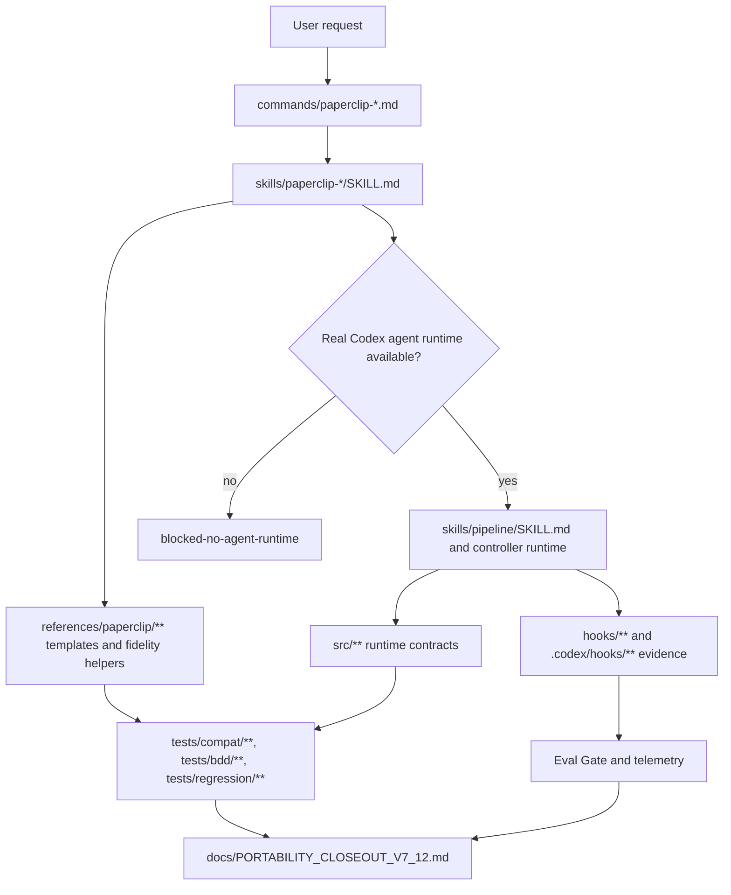

# Paperclip Runtime Surfaces

This diagram records the Codex adaptation boundary for Paperclip. It is a repo documentation artifact, not proof that the plugin is installed or active.

## Surface Ownership

| Surface | Owns | Does not prove |
| --- | --- | --- |
| `commands/paperclip-*.md` | public discovery text | runtime execution by itself |
| `skills/paperclip-*/SKILL.md` | workflow-specific operating contract | installed-cache activation |
| `references/paperclip/**` | canonical Paperclip reference material and template helpers | live board behavior |
| `src/**` and `hooks/**` | runtime and enforcement behavior | Marketplace publication |
| `tests/**` | repo-level regression and compatibility evidence | VPS dispatch or live plugin smoke |
| `evals/**` | local Eval Gate and telemetry evidence | global Codex hook activation |

## Claim Boundary

The closeout ledger must name the evidence layer. Repo-only documentation, diagrams, examples, and tests can close local Wave 6B documentation gaps, but public portability claims still require package-surface proof and installed-cache smoke proof.
